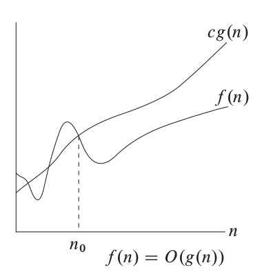
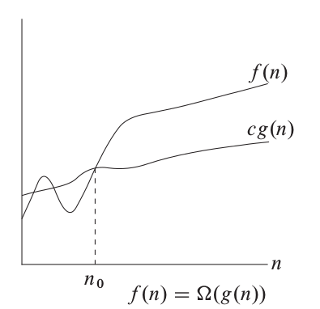
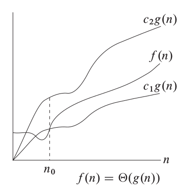

+++
slide = true
title = "Asymptotic notation"
+++

# Asymptotic notation

We will develop a way to measure the efficiency of algorithms which is _invariant_ to the non-essential issues such as the speed of computer hardware and the effiency of the programming language used.

[!](&&&)

The measurement functions is only sensitive to the _growth_ of the time it takes for an algorithm to complete with respect to the size of the input.

# Measure

- [!](comfort)
- The size of the input is an integer $n$
- We use functions over integers to measure the efficiency of an algorithm.
- $f(n)$ is the **time** it takes to process input of size $n$ in the _worst case_.
- $f$ is monotonic: if $m \leq n$, then $f(m)\leq f(n)$.
- $f$ is strictly positive: $f(n) > 0$ for all $n$.

# Using functions as measurement of algorithmic complexity

We want to use functions to measure the inherit _complexity_ of _algorithms_.

This is not very straight-forward.

[!](---)

[!](columns 6:)

*We don't care about*:

- [!](comfort)
- Runtime environment

	- CPU speed
	- Start-up time of the program

- Implementation issues

	- Speed of the language
	- Number of statements used
	- Overhead in memory data structure

[!](split)

*We do care about*:

- Inherit complexity of the algorithm

# Capturing the essentials

Suppose that we have an algorithm $P$.  Let's use some function $f(n)$ to represent the time, in the _worst case_, that $P$ takes to process an input of size $n$.

[!](&&&&&)

Let's look at the effects of various environmental factors on the measure $f(n)$.

# Effects on the measure

- $P$ is reimplemented using C (from Python), so it runs 20 times faster now.

	> $f'(n) = \frac{1}{20} f(n)$

- $P$ runs inside a _docker_ image, so it takes an additional 300 ms to start.

	> $f'(n) = f(n) + 300\mathrm{ms}$

But we don't want to care about these implementation and runtime factors when investigating the complexity of algorithms.

---

Intuition: given $f(n)$, we define family of (infinite) functions 

- [!](comfort)
- `$\{g(n): g(n)\ \mathrm{better\ than}\ f(n) \}$`
- `$\{g(n): g(n)\ \mathrm{worse\ than}\ f(n) \}$`
- `$\{g(n): g(n)\ \mathrm{equivalent\ to}\ f(n) \}$`

# $\mathcal{O}$-notation - better than

We want to define all function which are measure of algorithms which are better than (or same as) $g(n)$.

**Definition**: The Big-O notation

> `$$\mathcal{O}(g(n)) = \{f(n) : \exists n_0, c > 0,\forall n > n_0, \ 0 < f(n) < c\cdot g(n)\}$$`

We call $g(n)$ the asymptotic upper bound of the functions in $\mathcal{O}(g(n))$.

</img>

# Significance of asymptotic analysis

[!](columns 6:)

- If we have an algorithm $A$, and its precise time measurement (on a specific hardware) is given precisely as `$T(n)$`, where $n$ is the input size in _bytes_.

- If `$T(n)\in\mathcal{O}(g(n))$`, we are saying that $A$ is **better** than $g(n)$.

[!](split)

*Challenge*:

---

Check that the variations on the way that the efficiency of $A$ is 
measured also are in $\mathcal{O}(g(n))$.

1. $T_1(n)$ is the time that $A$ runs on a slow processor.

2. $T_2(n)$ is the time that $A$ if the input is measured in the array length.

# $\Omega$-notation - worse than

**Definition**: The $\Omega$-notation

> `$$\Omega(g(n)) = \{f(n) : \exists n_0, c > 0,\forall n > n_0, \ 0  < c\cdot g(n) < f(n) \}$$`

We say that $g(n)$ is the asymptotic lower bound of the functions in $\Omega(g(n))$.

</img>

# $\Theta$-notation - same as

**Definition*: The $\Theta$-notation

> `$$\Theta(g(n)) = \mathcal{O}(g(n)) \cap \Omega(g(n))$$`

More precisely,

`$$
\begin{eqnarray}
&& \Theta(g(n)) \\
&=& 
\{f(n): \exists n_0, c_1, c_2 > 0,\forall n > n_0,\ 0 \leq c_1\cdot g(n) \leq f(n) \leq c_2\cdot g(n)\}
\end{eqnarray}
$$`

</img>

# Recap

- $\mathcal{O}(g(n))$ is the collection of **all** the performance measures that are better (or equivalent) to $g(n)$.

- $\Omega(g(n))$ is the collection of **all** the performance measures that are worse (or equivalent) to $g(n)$.

- $\Theta(g(n))$ is the collection of **all** the performance measures that are equivalent to $g(n)$.

# Why is 