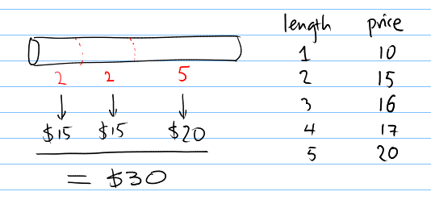
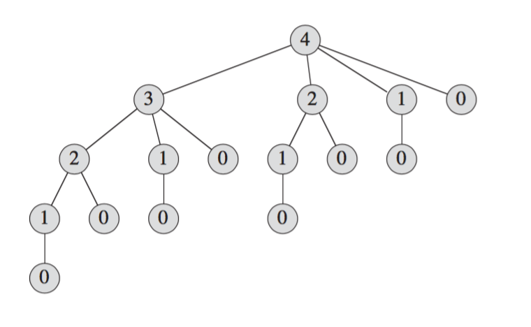

+++
slide = true
title = "Dynamic Programming"
+++

# Dynamic Programming

- Divide and conquer revisited 

- Recursive formulation of the solution

- Bottom-up computation of recursive formulation

[!](highlight)

# The rod cutting algorithm

[!](columns 8:)

</img>

_Can you do better than this cutting?_

[!](split)

- We are only allowed the cut the rod into integer-length intervals.

- The selling prices are not uniform, and given in a table.

- What is the best strategy to maximize the total revenue.

# _________________

Consider the following pricing:

| $i$ | 1 | 2 | 3 | 4 | 5 | 6 | 7 | 8 | 9 | 10 |
|---|---|---|---|---|---|---|---|---|---|----|
| $p_i$ | 1 | 5 | 8 | 9 | 10 | 17 | 17 | 20 | 24 | 30 |

Suppose we have a rod of length 4.  

- The optimal cutting is: cut(4) = 2 + 2
- The optimal revenue is: r(4) = $p_2 + p_2$ = 10

More generally, we write:

- Optimal cutting: $\mathrm{cut}(n) = i_1 + i_2 + \dots + i_k$,
- optimal revenue is: `$r(n) = p_{i_1} + p_{i_2} + \dots + p_{i_k}$`.

[!](box) How do we compute $\mathrm{cut}(n)$ and $r(n)$?

# _______________________

Consider an arbitrary length $n$.

Can we decompose this to smaller solutions?

[!](note) What if we know the optimal cutting for all lengths $< n$?

We can guess the length of the _last_ segment in the optimal cut(n).  Here are
the cases:

- There is only _one_ piece: cut(n) = n, so $r(n) = p_n$.
- The last piece is of length 1: cut(n) = cut(n-1) + 1.  So $r(n) = r(n-1) + p_1$.
- The last piece is of length 2: cut(n) = cut(n-2) + 2.
- The last piece is of length 3: cut(n) = cut(n-3) + 3.
- ...

Now, pick the _best_ guess.

`$$ r(n) = \max\{p_n, r(n-1) + p_1, r(n-2) + p_2, \dots\}$$`


# __________________________

A recursive formulation

```{python sm}
def cut_rod(p, n):
    "returns the maximal revenue for length `n`"
    if n == 0:
        return 0
    q = -infinity
    for i in range(1, n+1):
        q = max(q, p[i] + cut_rod(p, n-i))
    return q
```
> [!](note)
> $$ T(n) = 1 + \sum_{j=0}^{n-1}T(n-1) $$
>
> $$T(n) = \Theta(2^n)$$ -- ouch.

# __________________________

Let's look at the number of invocations of `cut_rod(p, 4)`:

</img>

[!](box) There are a number of redundancies.

# _________________________

Let's compute $r(n)$ bottom-up from $r(0), r(1), \dots$.

```{python sm nu}
def cut_rod(p, n):
    r = [0 for i in range(n+1)]
    for j in range(1, n+1):
        q = -infinity
        for i in range(1, j+1):
            q = max(q, p[i] + r[j-i])
        r[j] = q
    return r[n]
```

> [!](note)
> We can see that this algorithm (with the two nested loops) is in
> $\Theta(n^2)$.


# _________________________

So, far we have only computed the optimal revenue, but what abou the actual
segments?

It's easy to record the segment lengths:

```{python sm nu}
def cut_rod(p, n):
    r = [0 for i in range(n+1)]
    s = [0 for i in range(n+1)]

    for j in range(1, n+1):
        q = -infinity
        for i in range(1, j+1):
            if q < p[i] + r[j-i]:
                # the last segment is i.
                q = p[i] + r[j-1]
                s[j] = i
        r[j] = q

    return s, r[n]

```
[!](note) Still runs in $\Theta(n^2)$.

# __________________________

Exercise:

Work out $r(10)$ and the optimal cutting $\mathrm{cut}(10)$ using the bottom-up
`cut-rod` algorithm.

| $i$ | 1 | 2 | 3 | 4 | 5 | 6 | 7 | 8 | 9 | 10 |
|---|---|---|---|---|---|---|---|---|---|----|
| $p_i$ | 1 | 5 | 8 | 9 | 10 | 17 | 17 | 20 | 24 | 30 |


# Problem #2: String Edit Distance

*Definition*:

Given a string `$A = \left<a_1, a_2, \dots a_n\right>$` where $a_i$ are characters.
There are three types of string edit operations:

- `INSERT(A, i, c) = $\left<a_1, a_2, \dots, a_i, c, a_{i+1}, \dots,
  a_n\right>$`

- `DEL(A, i) = $\left<a_1, a_2, \dots, a_{i-1}, a_{i+1}, \dots, a_n\right>$`

- `REPLACE(A, i, c) = $\left<a_1, a_2, \dots, a_{i-1}, c, a_{i+1}, \dots, a_n\right>$`

*Problem*:

Given two strings $A$ and $B$, what is the minimal number of edit operations
required to transform $A$ to $B$?

# _____________________________

Solution to be discussed in class.
