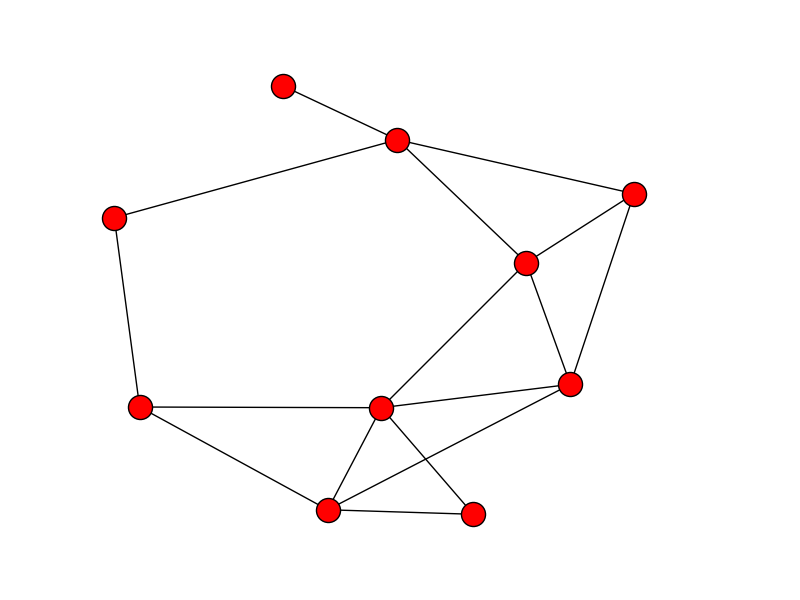
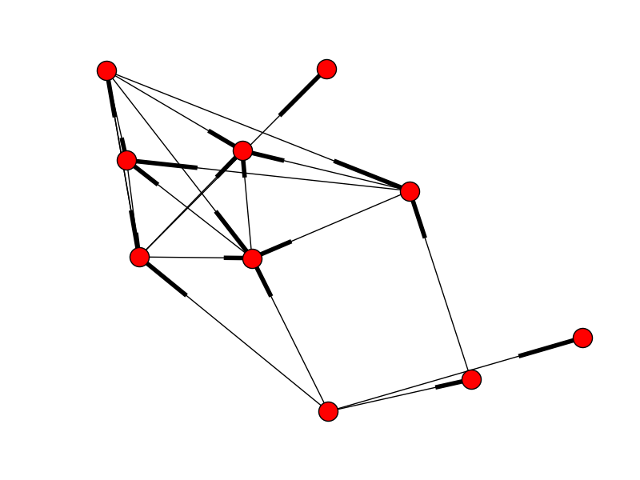
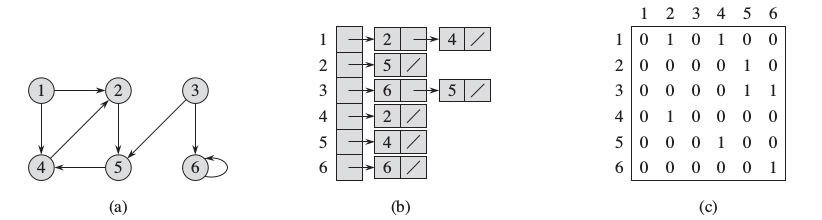
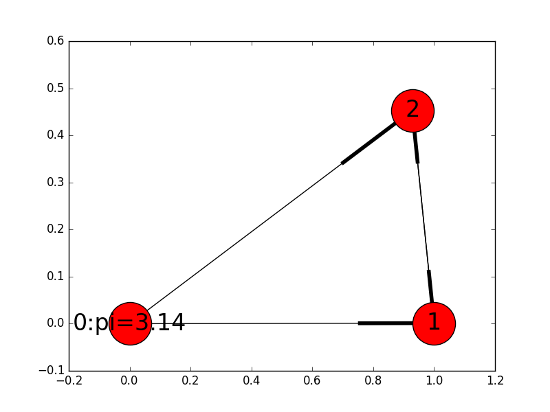
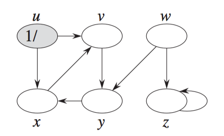
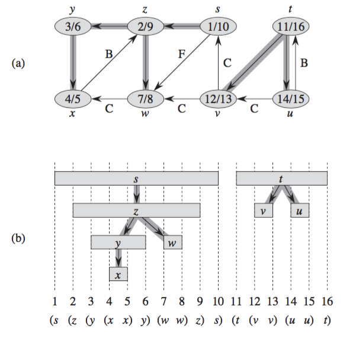
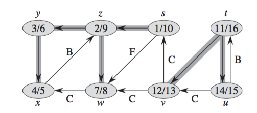
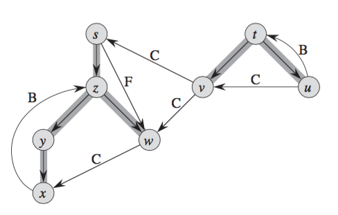
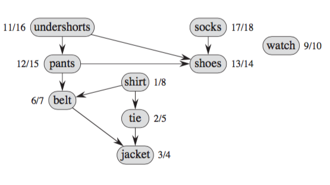
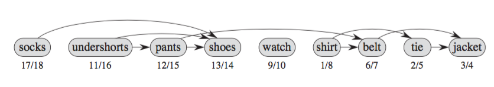

+++
slide = true
title = "Graph Algorithms"
nochalk = true
+++

# Graph Algorithms

[!](highlight)

# What are graphs?

- Vertices

    > Individual nodes, each with a unique identifier, and possibly some data
    > values.

- Edges

    > Vertices are connected by edges.  Edges can be _directed_ or _undirected_.
    >
    > Each edge can have some data value.

---

[!](columns 6:)

_An undirected graph_

</img>


[!](split)

_A directed graph_

</img>

# Data structures for graphs

A directed graph can be used to represent an undirected graph.

[!](note) Why?

---

## Encoding directed graph

[!](columns 10:)

</img>

[!](split note)

**(a)** The graph

**(b)** Adjacency list

**\(c)** Adjacency matrix

# Data structures for graphs

_Adjacency list_

```python
class Graph:
    def __init__(self):
        self.adjacency = dict()

    def add_node(self, v):
        self.adjacency[v] = []

    def add_edge(self, v1, v2):
        self.adjacency[v1].append(v2)
```

[!](note) Can you modify this to support labels to vertices and edges?

# Adjacency list implementation

```python
class Graph
    def __init__(self):
        self.adjacency = dict()
        self.nodes = dict()
        self.edges = dict()

    def add_node(self, v, data=None):
        self.adjacency[v] = []
        self.nodes[v] = data

    def add_edge(self, v1, v2, data=None):
        self.adjacency[v1].append(v2)
        self.edges[(v1,v2)] = data

    def node(self, v):
        return self.nodes[v]

    def edge(self, v1, v2):
        return self.edges[v]
```

[!](note) the additional hashmaps are used to map vertex and edge identifiers to
their respective data.


# Data structures for graphs

_Adjacency matrix_

```python
class Graph:
    def __init__(self, N):
        self.matrix = []
        for row in range(N):
            column = [0 for i in range(N)]
            self.matrix.append(column)

    def add_node(self, v):
        pass

    def add_edge(self, v1, v2):
        self.matrix[v1][v2] = 1
```

[!](note) Can you modify this to support labels to vertices and edges?

# Methods of graphs

```python
class Graph:

    # assume adjacency list implementation

    def neighbours(self, v):
        return self.adjacency[v]

    def nodes(self):
        return self.adjacency.keys()
```

# Graphs

_Paths_:

> A path in a graph $G$ is a sequence of vertices `$p = \left<v_1, v_2, \dots, v_n\right>$`
such that each adjacent pair of vertices are connected:
>
> `$$\forall i,\ (v_i, v_{i+1})\in\mathrm{edges}[G]$$`

_Reachability_:

> A vertex $y$ is reachable from $x$ if there exists a path `$\left<v_1, v_2,
> \dots, v_n\right>$` such that `$v_1 = x$` and `$v_n = y$`.

_Cycles_:

> A cycle is a path `$\left<v_1, v_2, \dots, v_n\right>$` such that `$v_1 =
> v_n$`.

# Graphs

_Shortest path_:

> The shortest path between two vertices $x, y$ is a path `$\left<v_1, v_2,
> \dots, v_n\right>$` such that `$v_1 = x$` and `$v_n = y$`.

_Distance_:

> The distance $d(x, y)$ between two vertices $x, y$ is defined as the length of a
> shortest path from $x$ to $y$.

# Direct acylic graph (DAG)

A DAG is a directed graph $G$ with no cycles.

[!](------)

<center>
</img>
</center>

# Tree

_Parent_

> A vertex $x$ is a _parent_ of $y$ in $G$ if $(x, y)\in\mathrm{edges}[G]$.

_Tree_

> A tree is a DAG $T$ in which every vertex has at most one parent.

[!](-----)

<center>
</img>
</center>

# Encoding of a tree

A tree can be very efficiently stored in a hash-map.

[!](columns 6:)

</img>

[!](split note)

The keys are the vertices (as their identifiers), and values as their parents.

| vertex | parent |
|--------|--------|
| 1      | 3      |
| 3      | 8      |
| 4      | 6      |
| 6      | 3      |
| 7      | 6      |
| 8      | -      |
| 10     | 8      |
| 13     | 14     |
| 14     | 10     |

# Hashmap encoding of a tree

| vertex | parent |
|--------|--------|
| 1      | 3      |
| 4      | 3      |
| 3      | -      |
| 2      | 1      |

[!](note) Can you re-construct the tree?

# Graph search

[!](highlight)

- Enumeration of a graph

# Breadth-first search (BFS)

- Starts at a given vertex as the starting point.

- Follow the edges to visit the neighbours.

- Makes sure that each vertex is visited at most once.

- Makes sure that all vertices _reachable_ from the starting vertex will be
  visited. 

[!](&&&)

_Intuition_:

> - Color all the vertices _white_ initially.
> - Coloring the vertices _black_ starting with the source.
> - Keep exploring the neighbours of black vertices until no more white
>   neighbours are found.

# Augment nodes with data

Assume that the vertices have hashmaps as data:

[!](columns 6:)

```python
G = Graph()
G.add_node(0, {"id": 0})
G.add_node(1, {"id": 1})
G.add_node(2, {"id": 2})
G.add_edge(0, 1)
G.add_edge(0, 2)
G.add_edge(1, 2)
G.add_edge(2, 1)
```

This allows us to add data:

```python
G.node(0)["pi"] = 3.14
```

[!](split)

</img>

# BFS

```{python nu sm}
def bfs(G, s):
    for v in G.nodes():
        G.node(v)["color"] = "white"

    queue = [s]
    G.node(s)["color"] = "gray"

    while len(queue) > 0:
        u = queue.pop(0)
        for v in G.neighbours(u):
            if G.node(v)["color"] == "white"
                queue.push(v)
                G.nodes(v)["color"] = "gray"
        G.nodes(u)["color"] = "black"
```

> - "white" vertex is unvisited
> - "gray" vertex has been explored, but neighbours unvisited
> - "black" vertex has been visited, and all neighbours also visited
> - `queue` are vertices with neighbours to be visited.
> [!](note)

# BFS

```{python nu sm}
def bfs(G, s):
    for v in G.nodes():
        G.node(v)["color"] = "white"

    queue = [s]
    G.node(s)["color"] = "gray"

    while len(queue) > 0:
        u = queue.pop(0)
        for v in G.neighbours(u):
            if G.node(v)["color"] == "white"
                queue.push(v)
                G.nodes(v)["color"] = "gray"
        G.nodes(u)["color"] = "black"
```


> Why is it _breadth_ first?
>
> ... because a first-in-first-out queue is used.
> [!](note) 

# BFS

[!](columns 8:)

```{python nu sm}
def bfs(G, s):
    for v in G.nodes():
        G.node(v)["color"] = "white"

    queue = [s]
    G.node(s)["color"] = "gray"

    while len(queue) > 0:
        u = queue.pop(0)
        for v in G.neighbours(u):
            if G.node(v)["color"] == "white"
                queue.push(v)
                G.nodes(v)["color"] = "gray"
        G.nodes(u)["color"] = "black"
```

[!](split)

_Theorem_:

> 1. A vertex turns _gray_ only _once_.
> 
> 2. A vertex turns _black_ only _once_.
> 
> 3. All vertices reachable from the source `s` will turn black.

# More BFS

_Theorem_:

> Consider two vertices $x, y$ both reachable from the source $s$.
>
> If $d(s, x) < d(s, y)$ then $x$ will turn gray before $y$.

[!](&&&)

We can use `BFS($G$)` to build a shortest-path tree from $s$, and compute the
distances from $s$ to every vertex in $G$.

# Shortest path tree and distance via BFS

```{python nu sm}
def bfs(G, s):
    for v in G.nodes():
        G.node(v)["color"] = "white"
        G.node(v)["distance"] = None   # Initialize
        G.node(v)["parent"] = None     # Initialize

    queue = [s]
    G.node(s)["color"] = "gray"
    G.node(s)["distance"] = 0

    while len(queue) > 0:
        u = queue.pop(0)
        for v in G.neighbours(u):
            if G.node(v)["color"] == "white"
                queue.push(v)
                G.nodes(v)["color"] = "gray"
                #-------------------------------------
                # compute the distance from s -> v
                # compute the parent of v in tree
                #-------------------------------------
        G.nodes(u)["color"] = "black"
```


# Shortest path tree and distance via BFS

```{python nu sm}
def bfs(G, s):
    for v in G.nodes():
        G.node(v)["color"] = "white"
        G.node(v)["distance"] = None   # Initialize
        G.node(v)["parent"] = None     # Initialize

    queue = [s]
    G.node(s)["color"] = "gray"
    G.node(s)["distance"] = 0

    while len(queue) > 0:
        u = queue.pop(0)
        for v in G.neighbours(u):
            if G.node(v)["color"] == "white"
                queue.push(v)
                G.nodes(v)["color"] = "gray"
                G.nodes(v)["distance"] = G.nodes(u)["distance"] + 1
                G.nodes(v)["parent"] = u
        G.nodes(u)["color"] = "black"
```

# Depth-first search

[!](highlight)

# Depth-first search (DFS)

- Recall BFS discovers a vertex when it's colored _gray_, and finishes with the
  discovery of a vertex when it's colored _black_.

- Not all vertices are guaranteed to be discovered by BFS.

- DFS is a more powerful enumeration method:

    1. It discovers all the vertices of a graph.

    2. It records the discovery time of each vertex.

# DFS

- Each vertex has:

    - A color: white, gray and black.

    - Two timestamps: discovery time (from white to gray) and finishing time
      (gray to black).

# DFS

```python
def dfs(G):
    for u in G.nodes():
        G.node(u)["color"] = "white"
        G.node(u)["parent"] = None
    t = 0
    for u in G.nodes():
        if G.node(u)["color"] == "white":
            t = dfs_visit(G, u, t)
```

# DFS-Visit

```python
def dfs_visit(G, u, t):
    t = t + 1
    G.node(u)["color"] = "gray"
    G.node(u)["d"] = t              # discovery time

    for v in G.neighbours(u):
        if G.node(v)["color"] == "white"
            G.node(v)["parent"] = u
            t = dfs_visit(G, v, t)

    G.node(v)["color"] = "black"
    t = t + 1
    G.node(v)["f"] = t              # finishing time
    return t
```

# Example

[!](columns 5:)

</img>

[!](split)

*Chanllenge*:

1. Work out the execution of `dfs_visit(G,u,0)`.

2. Work out the excution of `dfs(G)`.

3. Which vertices would not have been visited by `bfs(G, u)`?

# Properties of DFS:

[!](columns 6:)

*Theorem* (Parenthesis theorem)

> For any graph $G$, given any two vertices $(u, v)$, we have exactly one of the
> three possibilities:

> 1. $[u.d, u.f]$ and $[v.d, v.f]$ are disjoint.

> 1. $[u.d, u.f] \subset [v.d, v.f]$

> 1. $[u.d, u.f] \supset [v.d, v.f]$

[!](split)

</img>

# Predecessor subgraph of DFS

[!](columns 6:)

- Recall that each vertex has a data `["parent"]`.

- This induces one or more trees.

- Together, the trees are called the _predecessor subgraph_ of $G$.

[!](split)

</img>
</img>

# Applications of DFS: Topological sort

We have a list of tasks, which are interdependent by prerequisites:

> </img>

We would have to generate a plan to carry out the tasks:

> </img>

# Applications of DFS: Topological sort

1. Form the dependency graph of the tasks.  Each task is a vertex, and an edge
   $u\to v$ means that $v$ must be done sometime after *after* $u$.

2. Perform DFS on the dependency graph.

3. Sort the vertices (tasks) based on the decreasing ordering of the _finishing_
   time.

```python
def topo_sort(G):
    dfs(G)
    return sort(G.nodes(), key=\lambda u: G.node(u)["f"], reverse=True)
```

# Application: Strongly connected components

Recall the definition of _reachablility_:

> Vertex $u$ can reach $v$ if there exists path $p$ starting with $u$ to $v$.

Transpose of a directed graph:

> The transpose $G^T$ of a graph $G$ is the graph obtained by reversing all the
> edges.
