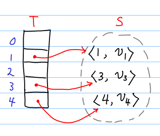
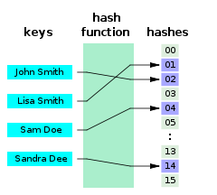
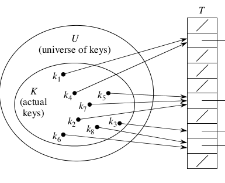
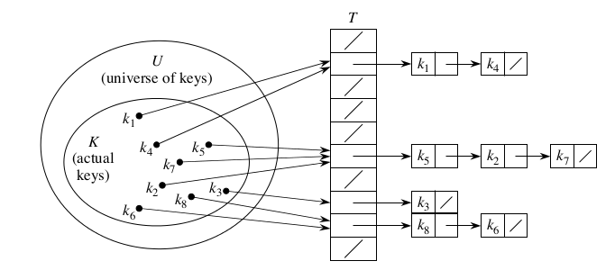

+++
slide = true
title = "Hash Tables"
+++

# Hash tables

[!](highlight)

# Dynamic sets

*Definition*

> A _dynamic set_, $S$, is a data structure that stores _distinct elements_.

We are interested to support the following functions:

- Insert: adds an element into `S`. 
  It does nothing if `x` is already in `S`.

    > `INSERT(S, x)`

- Search:

    > `SEARCH(S, x)`

- Delete:

    > `DELETE(S, x)`

# Direct Addressing

Consider the case of dynamic sets:

- Each element $x\in S$ is a pair 
  `$\left<\mathrm{KEY}[x], \mathrm{value}[x]\right>$`.

- The key $\mathrm{KEY}[x]$ is an integer in $[0, 1, \dots, N-1]$.

- No two elements have the *same* key:

    `$$\forall x, y\in S,\ x\not= y 
    \implies
    \mathrm{KEY}[x]\not=\mathrm{KEY}[y]$$`

[!](&&&)

[!](columns 6:)

A direct-address table is just an array $T$ of length $N$.

- Each slot corresponds to a key.

- For each element $x\in S$, $T[\mathrm{KEY}[x]] = x$.

[!](split)

</img>

# Implementation of direct address tables

```python
def DIRECT_ADDRESS_SEARCH(T, k):
    return T[k]
```

```python
def DIRECT_ADDRESS_INSERT(T, x):
    index = x.key
    return T[index] = x
```

```python
def DIRECT_ADDRESS_DELETE(T, x):
    index = x.key
    T[index] = None
```

# Properties of direct address tables

- Fast methods

    > All operations are $\Theta(1)$.

- But it's impractical

    > Most key spaces are at least 32-bits (some are 64-bits or higher).
    >
    > $N = 2^{32}$, and each table slot must be at least 
    > $\log_2(|S|)$ bits, $\simeq 10$ bits.
    >
    > The total memory required is $\sim 10\cdot 2^{32} = 1$ GB.
    >
    > The space requirement is $\Theta(N)$

# Hashing

- Let $U$ be the universse of *all* possible values that can appear in the
  dynamic set.

- Elements in $U$ are called the keys.

- A *hash function* is a function, $h$, mapping keys to _hash values_.

    > For $x\in U$, $h(x)\in[0, 1, 2, \dots, N-1]$

# Hash function

<center>
    </img>
</center>

# Hash Tables

- Still use an array $T$ as a table with $m$ slots.

    > But our objective is $m = \Theta(|S|)$, instead of $m = \Theta(N)$.

- Do not use _direct address_ policy.

- `T[index] = x`, where `index = $h$(x.key)`

---

[!](columns 6:)

**PROBLEM**: collision

> A _collision_ occurs if we have two $x, y\in S$ such that
  $x \not= y$, but $h(\mathrm{KEY}[x]) = h(\mathrm{KEY}[y])$.

[!](split)

</img>

# Collision resolution

Before:

> Each slot in the table stores a single element in the dynamic set.

After:

> Each slot in the table stores a _list_ of elements in the dynamic set.
> This is called _chaining_.

</img>

# INSERT with chaining

```python
def HASHTABLE_INSERT(T, x):
    index = h(x.key)
    if T[index] == None:
        T[index] = []
    T[index].append(x)
```

# SEARCH with chaining

```python
def HASHTABLE_SEARCH(T, key):
    index = h(key)
    if T[index] == None:
        return False
    else:
        for x in T[index]:
            if x.key == key:
                return x
        return False
```

# DELETE with chaining

```python
def HASHTABLE_DELETE(T, key):
    index = h(key)
    if T[i] == None:
        return
    else:
        remove(T[i], key)
```

```python
def remove(array, key):
    for (i, x) in enumerate(array):
        if x.key == key:
            array[i:i+1] = []
            return
```

# Analysis 

[!](columns 6:)

```{python sm}
def HASHTABLE_INSERT(T, x):
    index = h(x.key)
    if T[index] == None:
        T[index] = []
    T[index].append(x)
```

[!](split)

`HASHTABLE_INSERT` is done in $\Theta(1)$.

# Analysis

[!](columns 6:)

```{python sm}
def HASHTABLE_SEARCH(T, key):
    index = h(key)
    if T[i] == None:
        return False
    else:
        for x in T[i]:
            if x.key == key:
                return x
        return False
```

[!](split)

`HASHTABLE_SEARCH` is done in $\Theta(L)$ where $L$ is the average length of the
lists.

If we assume uniform hash value distribution of the keys, we get:

$$ L = \frac{|S|}{|T|} $$

This is known as the load factor of the hash table.

Typically, we want to keep the load factor as 0.75:

$$ |T| \simeq 1.3 |S| $$

# Properties of a good integer hash function

*Assumption*: a hash function $h$ maps *all* natural numbers $[0, 1, \dots]$ to a finite interval $[0
\dots m-1]$.

---

*Uniformity*:

Given any two keys, there is no relationship between $|a - b|$ and $|h(a) - h(b)|$.

So, if two keys are close to each other, there hash values are still randomly
distributed in $[0, m]$.

# The division method

```python
def h_div(key, m):
    return key % m
```

---

The choice of $m$ can makes `h_div` rather poor in uniformity:

- $m = 2^p$: observe that `key mod m` is the last $p$ bits of `key` in binary.

# The multiplication method

```python
import math

def h_mul(key, m, A):
    assert(0 < A < 1)
    prod = key * A
    frac = prod - math.floor(prod)
    return math.floor(m * frac)
```

---

This hash function is more versatile because we can set `m` freely.  `A` needs
to be selected wisely.

A good choice is:

$$ A = \frac{\sqrt{5} - 1}{2} \simeq 0.618034 $$

# Hashing general byte arrays.

What if the key is not an integer, but rather a byte array?

---

Many solutions:

- Consider the key as a large integer of radix based 128 (signed int).

- Consider the key as a vector of integers 

    `$$[k_1, k_2, \dots, k_n]$$`

    The final hash value is: $h(\sum_i k_i)$.

# Universal hashing

- Hash table's performance degenerates when we have collisions.

- Adversorial attack on hash table implementations:

    > Feed data with different keys, but all hash to the same bucket,
    > causing the search time to degenerate to linear time (bad), and thus
    > choke the processing of search queries.

- Adversory needs to know the hash function used to generate keys to cause
  collision.

---

*Premise*:

The source code of the hash table implementation is *public* and *open sourced*.

# Universal hashing

What if we have a family of hash functions to choose from: `H`?

```python
import random

class RandomHashTable:
  def __init__(self, m, H):
    self.h = random.sample(H, 1)
    self.T = [[] for i in range(m)]

  def insert(self, x):
    index = self.h(x.key)
    self.T[index].append(x)

  def search(self, key):
    index = self.h(key)
    for x in self.T[index]:
      if x.key == key:
        return x
    return None
```

[!](note) How does this stop the adversary?

# Universal hashing

The choice of `H` must be good.  

Consider the following *bad* choices of `H`:

- non-uniform hash functions:

    `h_div($\circ$, $2^p$) $\in$ H` 

- all hash functions are too similar.

# Property of universal hashing

*Definition*:

The collection of hash functions `H` is *universal* if:

> for all distinct keys $a, b$, the number of hash functions `$h\in$ H` with
> $h(a) = h(b)$ is at most $|H| / m$.

[!](&&&)

*Theorem*

> If `H` is universal, then the implementation of `RandomHashTable` has
> collision with probability of 1/$m$.

# Proof

Let `$H = \{h_1, h_2, \dots h_n\}$.

Let $a, b$ be two distinct keys: $a\not= b$.

What is the probability that `RandomHashTable` has a collision?

Let $h\in H$ be **randomly** selected.

What is the probability that $h(a) = h(b)$?

`$$\begin{eqnarray}
\mathbf{E}\{p(h(a) = p(h(b)): h\in H\} 
&=&  p(h(a) = h(b) | h = h_1)p(h=h_1) \\
&&   +  p(h(a) = h(b) | h = h_2)p(h=h_2) \\
&&   +  p(h(a) = h(b) | h = h_3)p(h=h_3) + \dots \\
&=&  |H| \times (1/m) \times (1/|H|) \\
&=& 1/m
\end{eqnarray}
$$`

<div style="float:right"><b>Q.E.D.</b></div>

# Designing Universal Hashing

- $h_{ab}(k) = ((a\cdot k + b)\ \mathrm{mod}\ p)\ \mathrm{mod}\ m$

    > where $p$ is a prime number.

- `$\mathcal{H}_{pm} = \{h_{ab} : a\in[1\dots p-1], b\in [0\dots p-1]\}$`

    > *Theorem*: $\mathcal{H}_{pm}$ is universal.

# Summary

[!](highlight)

- Hash tables with chaining

- Hash functions

- Universal hashing


