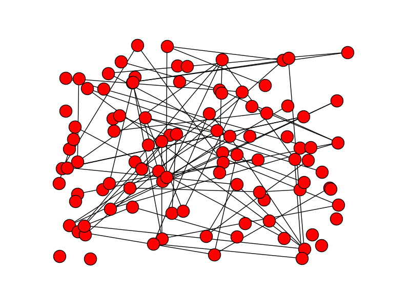

+++
slide = true
+++

# Basic programming

[!](columns 6:6)

We use *Python* for this course.

> Basic Python will do for the most part of this course.

[!](split)

If you are not used to Python (anymore), you are only *one* day away
of catching up.

- https://www.codecademy.com/learn/python

# Programming & This Course


[!](columns 6:6)

We don't need much programming for this course because we absolutely will be
focused on the *algorithms*.

[!](split)

But ...


The reality is that *programming* is absolutely essential.


Basic programming for this course
==============================================================


[!](columns 8:)

~~~python
x = [1, 2, 3]

print "The middle number is %d" % x[1]
~~~


[!](split)

We need arrays as a fundamental data structure.

[!](break) =================================================

[!](columns 8:)

~~~python
class Student:
    name = "Unknown"
    age = 18

    def __init__(self, name):
        self.name = name

jack = Student("Jack")

print "%s: %s" % (jack.name, jack.age)
~~~

[!](split)

We need objects.

[!](break) =================================================

[!](columns 8:)

~~~python
i = 0
while i < 10:
  print i
  i += 1
~~~

~~~python
for i in range(10):
  print i
~~~


[!](split)

Various loops are needed.

[!](break) ==================================================================

[!](columns 8:)

~~~python
def reverse_string(s):
    reversed_s = ""
    for c in s:
      reversed_s += c
    return reversed_s
~~~

[!](split)

We need functions, mostly to better organize the implementation of an algorithm.


[!](break) ============

We may need to rely on external Python libraries for data generation and visualization of algorithmic actions.

[!](columns 4:)

</img>

[!](split)

~~~python
import networkx as nx
import matplotlib.pyplot as plot

G = nx.erdos_renyi_graph(100, 0.015)
nx.draw(G)
plot.save("random-graph.png")
~~~


# The sorting problem

[!](columns 9:)

- Input:

    > An array of elements: $x$
    > where the elements are to be compared by a *comparator* function:
    >
    > `$$f(x_1, x_2) \in \left[
    \begin{array}{cc}
    -1 & x_1 < x_2 \\
    0 & x_1 = x_2 \\
    1 & x_1 > x_2
    \end{array}\right.$$`

- Output:

    > A permutation $y$ of the array of $x$, such that
    >
    > `$$\forall i,j\in[0, \mathrm{length}(y)],\quad i\leq j \implies y[i] \leq y[j]$$`

[!](split)

- This is called *comparison based sorting*.
- The comparison function can be arbitrary, and it defines the ordering.


# The sorting problem

- Permutation $\pi : [0, n] \to [0, n]$ such that `$i\not= j\implies \pi(i)\not=\pi(j)$`

- Given a sorting problem $(x, f)$, there can be multiple non-unique permutations that sorts $x$.

    > ~~~python
    > x = [3, 2, 2, 1]
    > ~~~

- Stable sorting requires an additional condition on the permutation:

    `$$ \forall i,j\in [0, \mathrm{length}(x)],\ i < j\ \mathrm{and}\ f(x[i], x[j]) = 0 \implies \pi(i) < \pi(j) $$`


# Insertion sort

> It's a highly *inefficient* sorting algorithm.

It's simple enough that:

1. It's intuitive.
2. It can be fully analyzed relatively easily.

# Insertion sort: the intuition

Suppose you have an array such that the *initial* subarray is already sorted.  But the last element may be out of place.

```x
+---+---+---+----+---+
| 2 | 4 | 5 | 10 | x |
+---+---+---+----+---+
```

*Q*:

> What is a procedure to rearrange such array?  Imagine that `x=7`.

# Insertion sort

[!](columns 4:)

</img>

Chapter 2, Figure 2.1 of textbook.

[!](split)

~~~{python}
def insertion_sort(A):
  for j in range(1, len(A)):
    key = A[j]
    i = j-1
    while i >= 0 and A[i] > key:
        A[i+1] = A[i]
        i = i - 1
    A[i+1] = key
~~~

# Try it out

[!](columns 6:)

~~~{python sm clipboard}
def insertion_sort(A):
  for j in range(1, len(A)):
    key = A[j]
    i = j-1
    while i >= 0 and A[i] > key:
        A[i+1] = A[i]
        i = i - 1
    A[i+1] = key
~~~

~~~{python sm clipboard}
import random
A = [random.randint(0, 100) for i in range(10)]
print A
~~~

~~~{python sm clipboard}
insertion_sort(A)
print A
~~~

[!](split)




# Analysis of correctness

- Intuition is not to be trusted.

- We can formally prove that an algorithm is correct.
  But first, we need some machinery.


# Loop invariance

[!](columns 4:)

Consider a loop:

~~~python
total = 0
count = 0

for v in array:
  total += v
  count += 1

avg = total / count
~~~

[!](split)

- Precondition of a loop: 
  a statement that is **always** *true at the start of
  the loop.

- Postcondition of a loop:
  a statement that is **always** true at by the end of
  the loop.

  <br>

- **Loop invariance**:
  a statement that is **always** true 
  <span style=color:#44f;font-size:120%>right at the end</span> 
  of each iteration of
  the loop.

    At the _end_ of the $i$-th iteration:

    > - [!](comfort)
    > - `count`$_i$ $\not=$ `0` 
    >    <i class="fa fa-thumbs-up"></i>
    > - `total``$_{i+1} \geq$` `total``$_i$`
    >    <i class="fa fa-thumbs-down"></i>:
    >    This is not a loop-invariance because it may not be true.
    >    Consider if $v < 0$ for some iteration.

# Correctness of `INSERTION SORT` by loop-invariance

[!](columns 5:)

~~~{python small}
def insertion_sort(A):
  for j in range(1, len(A)):
    key = A[j]
    i = j-1
    while i >= 0 and A[i] > key:
        A[i+1] = A[i]
        i = i - 1
    A[i+1] = key
~~~

[!](split)

There are two loops, with `while`-loop nested in the `for`-loop.


# Correctness of `INSERTION SORT` by loop-invariance

[!](columns 5:)

~~~{python small}
def insertion_sort(A):
  for j in range(1, len(A)):
    key = A[j]
    i = j-1
    while i >= 0 and A[i] > key:
        A[i+1] = A[i]
        i = i - 1
    A[i+1] = key
~~~

[!](split)

**Inner-loop invariance**

If we assume that $A[0 .. j-1]$ is sorted, then
the following loop invariance holds for the `for` loop:

At the end of the iteration, we have $A[i\dots j]$ is sorted.

---

> Can we say anything about `A[j+1]` to `A[len(A)-1]`?


# Correctness of `INSERTION SORT` by loop-invariance

[!](columns 5:)

~~~{python small}
def insertion_sort(A):
  for j in range(1, len(A)):
    key = A[j]
    i = j-1
    while i >= 0 and A[i] > key:
        A[i+1] = A[i]
        i = i - 1
    A[i+1] = key
~~~

[!](split)

**Outer-loop invariance**

> The subarray `A[0 .. j]` is sorted after the $j$-th iteration of the `for`-loop.

*Proof*: We prove by induction on $j$.

*Base case*

> $j=0$, trivially true

*Induction*

> If `A[0 .. j-1]` is sorted, by the inner-loop invariance, moving key to
> `A[i+1]` makes `A[0 .. j]` sorted.


# Correctness of `INSERTION SORT` by loop-invariance

[!](columns 5:)

~~~{python small}
def insertion_sort(A):
  for j in range(1, len(A)):
    key = A[j]
    i = j-1
    while i >= 0 and A[i] > key:
        A[i+1] = A[i]
        i = i - 1
    A[i+1] = key
~~~

[!](split)

*Theorem*:

> The `insertion_sort` algorithm always correctly sorts the input array.

*Proof*:

> By the outer-loop invariance, by the end of the last iteration,
> with $j=$`len(A)-1`, the entire array `A[0 .. len(A)-1]` is sorted.


[!](break) =================================================================

# Performance analysis

[!](highlight)

[!](break) =================================================================

### Every statement takes the same amount of time.

> This is not exactly correct, but it is accurate enough to gauge the
> performance of algorithms.

----

### *Corollary*

> We measure the number of lines executed by the program before an array is
> completely sorted by `insertion_sort`.

> $T_\mathrm{LOC}(\mathrm{length}(A)) \Rightarrow T(n)$

[!](break) =================================================================

[!](columns 5:)

~~~{python small}
def insertion_sort(A):
  for j in range(1, len(A)):
    key = A[j]
    i = j-1
    while i >= 0 and A[i] > key:
        A[i+1] = A[i]
        i = i - 1
    A[i+1] = key
~~~

[!](split)

- Best case analysis

- **Worst case analysis**

- Average case analysis

[!](break) =================================================================

[!](columns 5:)

~~~{python small}
def insertion_sort(A):
  for j in range(1, len(A)):
    key = A[j]
    i = j-1
    while i >= 0 and A[i] > key:
        A[i+1] = A[i]
        i = i - 1
    A[i+1] = key
~~~

[!](split)

**Worst case analysis**

Let $n = \mathrm{length}(A)$

> - The outer-loop *always* iterates $n$ times.
> 
> - The inner loop iterates *in the worst case* $j$ times.

---

`$$ T(n) \leq \sum_{j=0}^n j = \frac{n(n-1)}{2}$$`


[!](break) =================================================================

[!](columns 6:)


`insert_sort` is a pretty inefficient algorithm.

| n | T | time (1M LOC/s)|
|---|---|------|
| 10 | 45 | 45 $\mu s$ |
| 100 | 4950 | 5 $ms$ |
| 1000 | 499500 | 0.5 $s$ |
| 1000000 | 499999500000 | 5.9 days |

[!](split)

A more efficient algorithm (to be discussed later):

| n | T | time (1M LOC/s)|
|---|---|------|
| 10 | 23 | 23 $\mu s$ |
| 100 | 460 | 0.46 $ms$ |
| 1000 | 6907 | 6.9 $s$ |
| 1000000 | 13815510 | 13.8 $s$ |


# Summary

[!](highlight)

- INSERTION sort
- Analysis of correctness by loop-invariance
- Performance analysis by counting lines executed

---

Text: 2.1, 2.2,

# Challenge

Is `INSERTSORT` a stable sorting algorithm?

Recall:

> Stable sorting requires an additional condition on the permutation:
>
> `$$ \forall i,j\in [0, \mathrm{length}(x)],\ i < j\ \mathrm{and}\ f(x[i], x[j]) = 0 \implies \pi(i) < \pi(j) $$`
