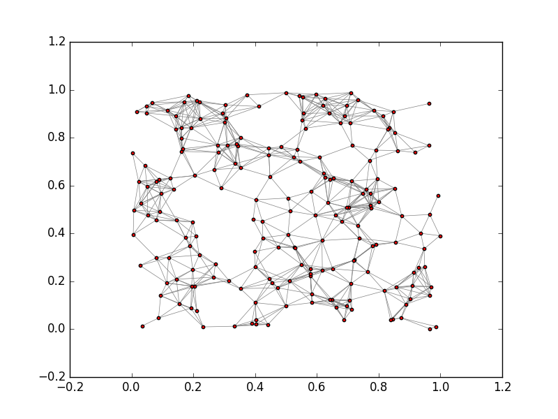
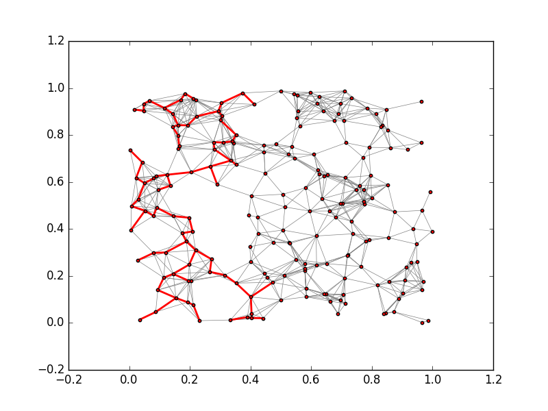
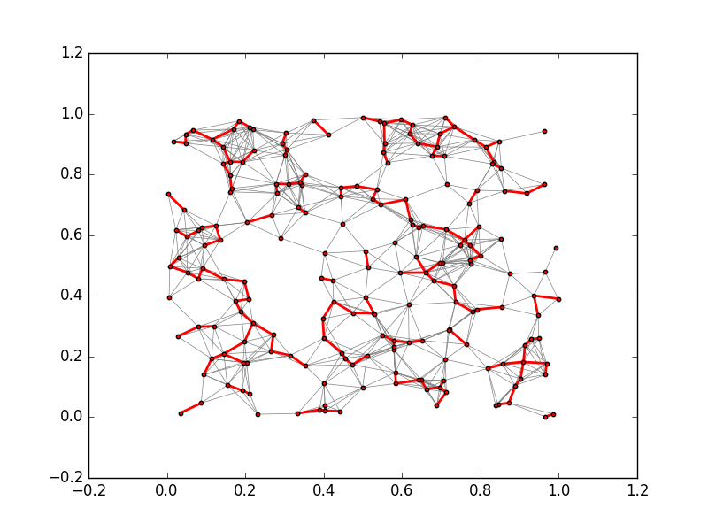
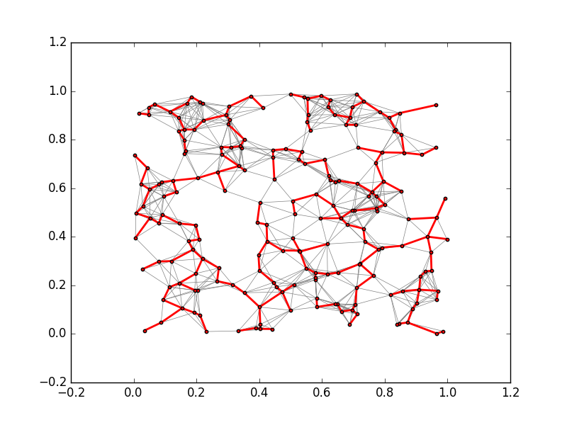

+++
slide = true
title = "Minimal Spanning Trees"
+++

# Definitions

A undirected graph $G$ is a graph with:

- Vertices: $V(G)$
- and edges $E(G)$ such that each edge `$\{u, v\}\in E(G)$` has no direction.

</img>

# Review of encoding of undirected graph:

- Adjacency list

    > If $G$ is an undirected graph, we can create a directed graph, defined as:

    > - $V(H) = V(G)$, and
    > - for each `$\{u, v\}\in E(G)$`, we have $(u, v)\in E(H)$ and $(v, u)\in
      E(H)$.


# Weighted edges

Let $G$ be an undirected graph.  Consider that we have weights on the edges:

$$ w: E(G) \to \mathbb{R}^+ $$

Namely, the function $w$ maps edges to strictly positive real numbers.

---

[!](columns 6:)

</img>

[!](split note)

We can use the distance between vertices as the weight:

`$w(\{u, v\}) = d(\mathrm{pos}(u), \mathrm{pos}(v))$ `

where $\mathrm{pos}$ is the 2D position of the vertex.

# The Minimal Spanning Tree (MST) Problem

*Definition* Spanning tree

> A tree $T$ is called a spanning tree of $G$ *if*
>
> - $T$ is fully connected, and
>
> - $V(T) = V(G)$

*Definition* Minimal spanning tree (MST)

> Let the weight of a graph 
> $$w(H) = \sum_{e\in E(H)} w(e)$$
>
> A MST, $T$, of a graph $G$ is a spanning tree of $G$ with the smallest
> possible $w(T)$.

# Example

</img>

[!](note) Not a spanning tree

# __________

</img>

[!](note) A (minimal) spanning tree

# Algorithms to compute MST

[!](highlight)

- Prim's algorithm

- Kruskal's algorithm

# Prim's algorithm

*Problem:*

Let $G$ be an undirected graph, with edge weights given by $w$.
Let $r$ be a vertex in $V(G)$.

Compute a MST $T$ starting with $r$.

```
def prim(G, w, r):
    ...
```

---

We represent $T$ as a set of edges.

[!](note) Why don't we need to remember the vertices of $T$?

# _______________

*Definition* Minimal cut

> Let $X\subseteq V(G)$ be a set of vertices in $G$. 
The minimal cut is an edge $\{u, v\}\in E(G)$ such that
$u\in X$ and $v\not\in X$ with the *smallest* weight.

[!](note) There may be non-unique minimal cuts.

[!](&&&)

*Theorem*:

> If $S$ is a subtree of a MST, and let $e$ be a minimal cut of $V(S)$, then
$S\cup\{e\}$ is also a subtree of a MST.

# __________________

*Cool,*

>> Start with just a root $X = \{r\}$, and keep adding minimal cuts of $X$.

---

```python
def prim(G, w, r):
    n = G.count_nodes()
    X = set([r])
    T = set([])
    for i in range(n-1):
        (u, v) = minimal_cut(G, X)
        X.add(u, v)
        T.add((u, v))

    return T
```

[!](note) **Warning**: what happens if $G$ is not fully connected?

# Kruskal's algorithm

Find a MST by computing its edges.

```
def kruskal(G, w):
    ...
```

# _____________

*Theorem*

> Let $R$ and $S$ be two *disjoin* subtrees of a MST.  If there exists an edge
`$\{u, v\}$` that is a minimal cut of $S$, and `$u\in V(S)$` and `$v\in V(R)$`, then
`$R\cup S$` is also a subtree of a MST.

---

*Cool,*

Start with lots of small subtrees of a MST, and merge them with minimal cuts
until we end up with just one tree that covers all the nodes.

# _______________

*Observation*:

> 1. Every vertex by itself is a subtree of a MST (trivially).  

> 2. The smallest edge is always a minimal cut.

> 3. Represent subtree by its vertices.

# __________________

*Definition*: Partition

A partition of the vertices of $G$ is a collection of sets of vertices 
`$P = \{X_1, X_2, \dots X_n\}$`, such that:

> 1. They are all pairwise disjoint.
> 2. Every vertex in $G$ appears in exactly one of the `$\{X_i\}$`.
> 3. None of the `$X_i$` is empty.

---

*Operations* on a parition `P`:

```
i = find_partition(P, v)
```
[!](note) Finds the index such that $v\in X_i$

```
join_partition(P, i, j)
```
[!](note) Replace `$X_i, X_j$` from `P`, with `$X_i\cup X_j$`

# ______________

```python
def kruskal(G, w):
    T = set([])
    E = sorted(G.edges(), key=w)
    P = [set([v]) for v in G.nodes()]
    for e in E:
        (u, v) = e
        i = find_partition(P, u)
        j = find_partition(P, v)
        if not i == j:
            T.add(e)
            join_partition(P, i, j)
        if len(P) == 1:
            break
    return T            
```

# Example

</img>

# ___________

</img>

# ___________

</img>

# Summary

[!](highlight)

> Prim's algorithm starts with a specific vertex, and grows the MST by computing
minimal cuts.

> Kruskal's algorithm starts with $n$ subtrees, and uses the edges with the
smallest weights to join them together, eventually into a single MST.

# Special topics

- A simple undirected graph encoding using adjacency list:

    > <a href="code/graph.py">graph.py</a>

- A simple implementation of the MST algorithms:

    > <a href="code/mst.py">mst.py</a>

[!](***)

[!](box) We will go through the code and the networkx library that it uses to
draw the graphs in the lab.
