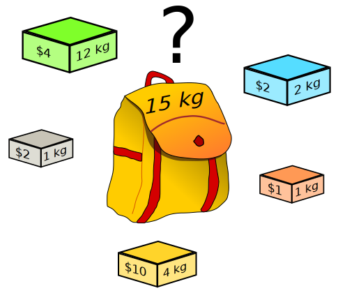
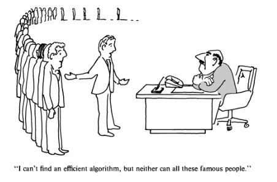

+++
slide = true
title = "NP Completeness"
script = "myscript.js"
+++

# NP-completeness

[!](highlight)

- Decision problems

- From optimization to decision problems

- Verification

- P & NP

- Completeness

- NP-completeness

# Decision problem

_Definition_

> A decision problem is a problem whose answer is YES or NO.

[!](***)

Examples of problems:

- *Connectivity test*: Given a graph $G$, is it fully connected?

- Given a polynomial $P(x)$ does it have an integer valued solution?

- Given an array $A$ and an element $x$, does $x$ appear in $A$?

- *Primality test*: Given an integer $K$, is it a prime number?

# Size of problem

- Each problem can have infinitely many instances.  Each instance has a size.

- The size of a problem is the number of symbols required to represent the
problem.

    >> We actually don't care if it's in binary or ASCII encoding.

# ________________________

Connectivity of a graph $G$:

> - We need $V$ symbols to represent each vertex.  Each symbol requires $\log(V)$
  bits for the vertex ID.

> - Each edge is $2\log(V)$ bits to encode the end-points of the edge.
  We need $E$ number of edges.

> - So the size of the instance is $V\log(V) + 2E\log(V)$ as a binary string.

Primality test:

> - We need $\log(K)$ bits to represent the integer.

> - So the size of the instance is $\log(K)$ as a binary string.

# Why decision problems?

1. We don't need to worry about the presentation of the solution. It's always 0
or 1.

2. It captures the essence of optimization.

# Optimization $\to$ decision

An optimization has two components:

> - An instance of the problem $P$, and

> - a cost function $f$ over all possible solutions.

> - [!](comfortable)

The solution is $S$ such that $f(S)$ is *optimal*.

# __________________________

We can convert an optimization problem to a decision problem:

[!](columns 6:)

- An instance $P$

- A cost function $f$

---

Solution is $S$ such that $f(S)$ is maximized.

[!](split)

- An instance $P$

- A cost function $f$ and a threshold $k$.

---

Yes if there exists a solution $S$ such that $f(S) \geq k$.

# _____________________

_Example_

Optimization:

> Given a graph $G$, and two vertices $s, t\in V(G)$, find the shortest path $p$ from
$s$ to $t$.

---

Decision:

> Given a graph $G$, and two vertices $s, t\in V(G)$, and a threshold $k$.
> 
> Is there a path $p$ from $s$ to $t$ with $w(p)\leq k$.

# Back to decision problems

## Solving a decision problem

An algorithm $\mathcal{A}$ such that for every instance $P$ of a certain type of
problem, $\mathcal{A}(P)\in\mathrm{Boolean}$ is the correct decision.

---

## Verifying a decision problem

An algorithm $\mathcal{B}$ such that for every instance $P$, a cost function
$f$, and the threshold $k$

- Given a candidate solution $S$ of $P$,

- $\mathcal{B}(P, k, S)$ verifies that $f(S)\leq k$.

# Verification is easier

Example:

> Given a graph $G$ and $s,t\in V(G)$, is there a path $p$ such that $w(p)\leq
> k$?

Can you construct $\mathcal{A}(G, s, t, k)$?

> Maybe, but it's just as difficult of constructing the Dijkstra's algorithm.
>
>>> Just as hard as the optimization problem.

# _____________

Example:

> Given a graph $G$ and $s,t\in V(G)$, is there a path $p$ such that $w(p)\leq
> k$?

Can you construct $\mathcal{B}(G, s, t, k, p)$, where $p$ is a path in $G$?

> 1. Check $p$ connects $s$ to $t$.
>
> 2. Find the total weight $w(p)$ and test if $w(p) \leq k$.
>
>>> Easy - can be done in $\mathcal{O}(n)$.

# Complexity classes: P

*Definition*: The **P** complexity class

> A class of decision problems is in **P** if the $\mathcal{A}$ can be
implemented in $\mathcal{O}(n^k)$ for some $k$, where $n$ is the input problem
size. 
>
> **P** is the collection of all types of problems that can be solved by
> algorithms in polynomial time.

---

## Example:

- Graph connectivity is in **P**.

# Complexity classes: NP

*Definition*: The **NP** complexity class

> A class of decision problems is in **NP** if the $\mathcal{B}$ can be
> implemented in $\mathcal{O}(n^k)$ for some $k$.
>
> **NP** is the collection of all types of problems that can be *verified* in
> polynomial time.

---

*Theorem*:

$$ \mathbf{P} \subseteq \mathbf{NP} $$

# The knapsack problem:

[!](columns 7:)

</img>

<a href="http://creativecommons.org/licenses/by-sa/2.5" title="Creative Commons
Attribution-Share Alike 2.5">CC BY-SA 2.5</a>, <a
href="https://commons.wikimedia.org/w/index.php?curid=985491">Link</a>

[!](split)

We have a collection of items, each with some weight $w_i$, and value $v_i$.

We have a total capacity $C$.

Which items $J$ do we take so that `$$\sum_{i\in J}  w_i \leq C$$` and we maximize
the total value `$$\sum_{i\in J} v_i$$`?

# Knapack: the decision problem

## Problem instance:

- The weights $\{w_i\}$ and values $\{v_i\}$, and capacity $C$.
- A threshold on value $k$.

## Solving:

- $\mathcal{A}(P)$ is a collection of items `$J= \{i_1, i_2, \dots\}$` such that
  `$\sum_J w_i \leq C$` and `$\sum_J v_i \geq k$`.

## Verifying:

- We are given a collection of items $J$, we need to check
  `$\sum_J w_i \leq C$` and `$\sum_J v_i \geq k$`.

# Knapsack:

Verification of knapsack can be done in $\Theta(n)$.

Therefore, $\mathbf{KNAPSACK} \in \mathbf{NP}$

---

So, $\mathbf{KNAPSACK} \in \mathbf{P}$ ???

> We don't know, and we have been working on it since 1970.

</img>

# Polynomial reduction

*Definition*

Let $X$ be a decision problem, and $Y$ another decision problem.  We can say
that $X$ no harder than $Y$ if there exists a polynormial-time algorithm 

`$$\theta:\mathrm{instance}(X)\to \mathrm{instance}(Y)$$`

such that:

$$ \forall P\in\mathrm{instance}(X), P\mathrm{\ is\ true} \iff \theta(P)
\mathrm{\ is\ true}$$

If there exists such $\theta$, then we say that

$$ X\leq^P Y $$

which reads $X$ is reduced to $Y$, and $\theta$ is the reduction.

# _______________________

*Intuition*

If $X\leq^P Y$, then $X$ can be solved using a solver for $Y$.  Furthermore,
since the reduction must be in polynormial time, we have:

$$ Y\in\mathbf{P} \implies X\in\mathbf{P} $$

---

$X$ is no harder than $Y$.

# NP-hard problems

*Definition*

A problem $Y$ is NP-hard if:

$$\forall\ X\in \mathbf{NP},\ X\leq^P Y$$

# NP-completeness

[!](columns 6:)

*A surprising discovery*:

There exists $Y\in\mathbf{NP}$ that is NP-hard.

---

*Definition*:

$\newcommand{\npc}{\mathbf{NP}\text{-complete}}$
$\newcommand{\nphard}{\mathbf{NP}\text{-hard}}$

`$$\npc = \mathbf{NP}\cap\nphard$$`

[!](split)

</img>

*Stephen Cook*, University of Toronto, 2013

# The significance of NP-complete problems

- They are easy to verify.

- They are the hardest problems to solve in NP.

- They are all equally hard to solve:

    $\forall X, Y\in\npc, X\leq^P Y \mathrm{\ and\ } Y\leq^P X$ (by definition)

    Therefore, $ X\simeq^P Y $

# Knapsack revisited

*Theorem*:

The decision problem of KNAPSACK is NP-complete.

$$ \mathbf{KNAPSACK} \in \npc $$

# Finding over NP-complete problems

The key is to use *reduction*.

*Observation*:

> If:
> 
> - $Y\in\mathbf{NP}$, and
> - $\exists X\in\npc$ such that $X\leq^P Y$
> 
> Then $Y\in\npc$.

# Our second NP-complete problem

*Integer linear programming* (ILP)

---

[!](columns 6:)

- A matrix
    
    `$$ A = \left[\begin{array}{ccc}
                  a_{11} & a_{12} & \dots \\
                  a_{21} & a_{22} & \dots \\
                  \vdots & \vdots & \ddots \\
                  \end{array}\right]_{mn} $$`

- Vectors

    `$$ C = \left[\begin{array}{c}
                  c_1 \\
                  c_2 \\
                  \vdots \\
                  \end{array}\right]_{m1}
    \quad
    B = \left[\begin{array}{c}
                  b_1 \\
                  b_2 \\
                  \vdots \\
                  \end{array}\right]_{n1} 
    \quad
    k \in \mathbb{R} $$`

- variables: 

    `$$ x = \left[\begin{array}{c}
                  x_1 \\
                  x_2 \\
                  \vdots \\
                  \end{array}\right]_{n1} $$`

[!](split)

Does there exists a solution for $x$ such that $x_i$ are integers satisfying:

1. $A\cdot x \leq C$, and

2. $B^T\cdot x \geq k$ ?

# Integer Linear Programming

*Claim*:

[!](box) $\mathbf{ILP}\in\npc$

*Proof*:

We can reduce KNAPSACK to ILP:

- $A$ is a diagonal matrix with the diagonal being the weights $w_i$.

- For each element $i$, we create an integer variable $x_i$.

- For each $x_i$, we impose $x_i <= 1$ and $-x_i <= 0$.  This forces each
  $x_i\in\{0, 1\}$.

- $C$ is the capacity.

- $B = [v_1 v_2 \dots v_n]$, so $B^T x$ is the total selected value.

# ______________

*Proof* continue

So we can see that KNAPSACK is _yes_ if and only if the corresponding ILP is
_yes_.

The transformation from KNAPSACK to ILP can be done in polynomial time, so

$$\mathbf{KNAPSACK}\leq^P\mathbf{ILP}$$

Since KNAPSACK$\in\npc$, we conclude ILP$\in\nphard$.

It's almost trivial to check that ILP can be _verified_ in polynomial time.
Therefore, $\mathbf{ILP}\in\mathbf{NP}$.

Therefore,

$$\mathbf{ILP}\in\npc$$

# Intractability

It's been over 30 years since we have tried to decide if $\npc\in\mathbf{P}$.

We know:

$$\npc\in\mathbf{P} \iff \mathbf{P} = \mathbf{NP}$$

The 3 decades of "failure" certainly means _one_ thing:

1. No human has ever come up with a polynomial algorithm for a NP-complete problem.

2. If you have a NP-hard optimization problem, don't bother trying to obtain the
optimal solution.  It's been a failed attempt for 30+ years.

# _________________

There are thousands of NP-complete problems known to us:

[!](box) https://en.wikipedia.org/wiki/List_of_NP-complete_problems

---

- Scheduling

- Pattern matching

- Chess

- Cracking passwords

and of course, Knapsack.

# The end

<button class="the-end show btn btn-primary" style="font-size: 100%">Thanks</button>

    </img>
    

    <a style="font-family:Roboto; font-size: 80%"
       href="http://www.bensound.com/">Bensound.com</a>
       <button class="btn btn-default stop">Stop</button>
    

    

    Best wishes,  

    Ken Pu, 2016.
    

