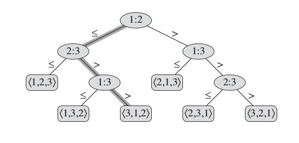

+++
slide = true
+++

# Optimal Comparison Based Sorting <br> v.s. <br>  Numerical Sorting

[!](highlight)

# Lower Bounds for Sorting

**Assumption**

> The elements in the array are *black boxes*, and only comparison can be made between two elements.

**The decision-tree model**

[!](columns 6:)

> Given a sorting algorithm $A$, we record *all* possible comparison operations executed in $A$.
>
> [!](box) A comparison operation: $(i,j)$ where $i, j$ are the _original_ index of the elements.

[!](split)

</img>

The leaf records the final ordering of the original index.

# Lower Bounds for Sorting


[!](columns 6:)

</img>

[!](split)

*Q*:

> How many comparison operations did $A$ take as illustrated in the diagram?

---

> What is the worst case number of comparision operations?

# Lower Bounds for Sorting

[!](columns 4:)

</img>

[!](split)

- [!](comfort)
- What type of tree is the deicion tree?

	> Binary tree

- How many leaf nodes are there for $n$ elements?

	> All possible permutations of $[1, 2, 3, \dots n] = n!$

- What is the height of the tree if there are $n!$ leaf nodes?

	> $\log_2(n!) \approx c\dot n\log(n)$

# Optimal Comparison Based Sorting

**Theorem**

> Any comparision based sorting algorithm will necessarily take at least $c n\log(n)$ number of comparison operations in the *worst* case.

**Optimal sorting**

> If a comparison based sorting algorithm always makes at most $c n\log(n)$ number of comparisons, then it's called *optimal*.


# Optimal Comparison Based Sorting


| Algorithm      | Optimal? |
|----------------|----------|
| Insertion sort | No, $n^2$ |
| Mergesort      | Yes |
| Quicksort      | No, $n^2$ in the worst case |

# Sorting Integers

[!](highlight)

> If an array contains (bounded) integers, we can beat optimal comparison based sorting.

Why?

> Elements are not blackboxes.  We can look at individual digits of an bounded integer.

# Counting sort

Assumptions:

> 1. The elements are integers.
> 2. The elements are all in the range of $[0, k-1]$ for some $k \geq 0$.

---

Amazing fact:

> With $n$ elements, we can do it with only $2\cdot(n+k)$ number of instructions,
> compare to $n\log(n)$ in the case of optimal comparison sorting.

# Counting sort

```{python clipboard}
def empty_array(size, init=None):
    return [init for i in range(size)]
```

[!](note) allocate an empty array with an optional initial value.

# Counting sort

[!](columns 8:)

```{python clipboard}
def COUNTING_SORT(A):
    n = len(A)
    k = max(A) + 1
    B = empty_array(size=n)
    C = empty_array(size=k, init=0)

    for a in A:
        C[a] = C[a] + 1

    for i in range(1,k):
        C[i] = C[i] + C[i-1]

    for a in reversed(A):
        B[C[a]-1] = a
        C[a] = C[a] - 1

    return B
```

[!](split note)

- [!](comfort)
- We compute the frequency of each distinct value in `A`.
- The frequence is then turned into cummulative frequency.  Namely:
    `$C[x] = |\{y\in A: y\leq x\}|$`
- With $C$, we can quickly deduce which each element should be positioned.

# Counting Sort

Question:

> Is `COUNTING_SORT` stable?

Answer:

> Yes.  It's crucial to place $x$ into `B` from `reverse(A)` instead of `A`.

# Summary

[!](highlight)

- [!](comfort)
- The best comparison sorting algorithms are in the order of $n\log(n)$.
- The best integer comparison algorithms can achieve the efficiency in the order of $n$.
- `COUNTING_SORT` requires too much memory in practice to be applied to arrays with large integer values.  However, it will be instrumental later (as part of radix sort).

---

The measure of algorithmic efficiency will be made much more rigorous in the next section of this course.