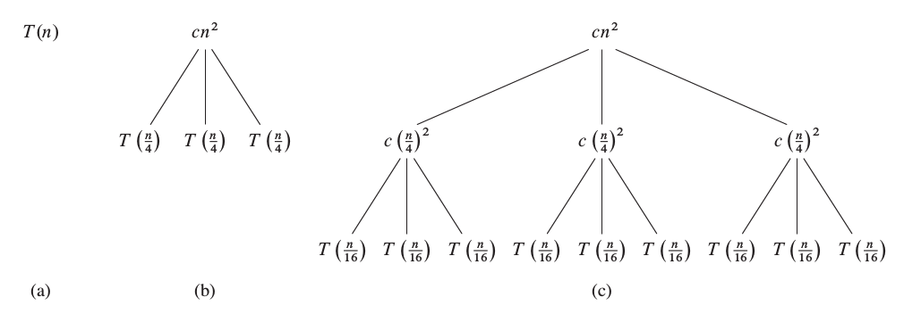
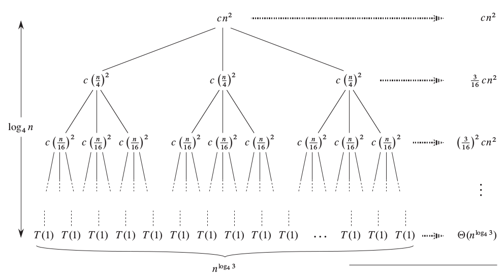

+++
slide = "true"
title = "Recurrence Equation"
+++

# Recurrence Equations

[!](highlight)

- Analysis of recursive algorithms
- Solving recurrence equation by substitution
- Solving recurrence equation by recurrence tree

# Recursion

We have already seen recursion used in sorting:

1. Top-down mergesort
2. Quicksort.

---

*Definition*: Recursion

> Recursion is when a procedure that:
> 
> 1. Divides the input into smaller problems,
2. and applies itself on the smaller problems, until
3. the problem is so small that it can be solved quickly.

# On mergesort

[!](columns 5:)

```{python sm}
def mergesort(A):
    # Termination
    if len(A) <= 1: return A

    # Recursion
    A1 = mergesort(A[:n/2])
    A2 = mergesort(A[n/2:])
    return merge(A1, A2)
```

[!](split)

Let $T(n)$ be the time for mergsort to terminate given an input array with $n$
elements.

We know:

`$$T(n) = \left\{\begin{array} 
                 \ \Theta (1) & \mathrm{\ if\ } n \leq 1 \\
                 T(n/2) + T(n/2) + \Theta(n) & \mathrm{\ else}
                 \end{array}\right.$$`

[!](box)
What is a good $g(n)$ for $T(n) = \mathcal{O}(g)$?


# Recurrence equation

A recurrence equation is an equation that defines $f(n)$ based
on $f(m)$ for some $m < n$, and other complexity classes.

[!](&&&)

For example:

$$ T(n) = 2 T(n/2) + \Theta(n) $$

# Quicksort

[!](columns 6:)

```{python sm nu}
def quicksort(A, p, r):
    k = partition(A, p, r)
    quicksort(A[p:k+1], p, k)
    quicksort(A[k+1:r+1], k+1, r)
```

[!](split)

$T(n)$ is time of quicksort for array of length $n$.

Note: $k$ is between $p$ and $r$ (inclusively).

**Worst** case:

> $k = p$ or $k = r$, i.e. the pivot is placed at the ends of the
> subarray.

**Best** case:

> $k = (p+r)/2$.

**Average** case:

> $k = \alpha p + (1-\alpha) r$ for some $0\leq \alpha\leq 1$.

# Quicksort

[!](columns 6:)

```{python sm nu}
def quicksort(A, p, r):
    k = partition(A, p, r)
    quicksort(A[p:k+1], p, k)
    quicksort(A[k+1:r+1], k+1, r)
```

[!](split)

`$T(n) = \Theta(n) + T(n_\mathrm{line3}) + T(n_\mathrm{line4})$`

**Worst case**:

> - `$n_\mathrm{line3} = 1$`
> - `$n_\mathrm{line4} = n-1$`
> - `$T(n) = \Theta(n) + T(n-1)$`

**Best case**:

> - `$n_\mathrm{line3} = n/2$`
> - `$n_\mathrm{line4} = n/2$`

**Average (general) case**:

> - `$n_\mathrm{line3} = \alpha n$`
> - `$n_\mathrm{line4} = (1 - \alpha) n$`

# Quicksort

So we get:

**Worst-case**:

`$$T(n) = \Theta(n) + T(n-1)$$`

**General case**:

`$$\begin{eqnarray}
T(n) &=& \Theta(n) + T(\alpha n) + T((1-\alpha) n) \\
     &\leq& \Theta(n) + 2T(\alpha n)
\end{eqnarray}$$`

Note, without loss of generality, we assume `$\alpha \geq 1/2$`.

# Recurrence Equation

1. Assume that $T(n) = \mathcal{O}(f(n))$ for some initial _guess_ of $f(n)$.
2. Show by induction on $n$, that the recurrence equation is satisfied.

[!](-----)

If we are just interested at the asymptotic upperbound, we can relax recurrence
equations to recurrence inequalities.

Example:


> `$T(n) = \Theta(n) + T(n-1)$`
> 
> becomes
> 
> `$T(n) \leq \Theta(n) + T(n-1)$`

# Solving by substitution

1. Guess a solution $T(n) = \Theta(f(n))$.
2. Check if the solution satisfies the recurrence equation.

[!](-------)

1. Guess a complexity class $T(n) = \mathcal{O}(f(n))$.
2. Check if the solution satisfies the recurrence inequality.

# Example

$T(n) = \Theta(n) + T(n-1)$.

Let's show that $T(n) = \mathcal{O}(n^2)$.

---

**Note**:

Always state the **assumptions**, and the next step **clearly** as _"Need to
show"_.

> **Assumption**:
> 
> $T(n) = T(n-1) + \Theta(n)$.

and

> **Need to show**:
>
> $T(n) = \mathcal{O}(n^2)$

# Example

**Need to show**:

There exists some $a, b, c$ such that $T(n) < a n^2 + b n + c$ for all large $n$.

[!](note) We observe that $a n^2 + bn + c = \mathcal{O}(n^2)$ for all $a, b, c$ (verify).

---

We prove by induction that such $a, b, c$ exist.

Suppose that $T(k) \leq a k^2 + bk + c$ for all $k < n$, we **need to show**
$T(n) \leq a n^2 + bn + c$.

# Example

**Know**

- $T(n) = T(n-1) + \Theta(n)$

- $T(k) \leq a k^2 + bk + c$ for all $k < n$

**Need to show**

- $T(n) \leq a n^2 + bn + c$.

---

`$$
\begin{eqnarray}
T(n) &=& T(n-1) + \Theta(n) \\
     &\leq& a (n-1)^ + b(n-1) + c + dn \\
     &\leq& an^2 + (b+d-2a)n + (c+1)
\end{eqnarray}
$$`

**Need to solve** for $(a, b, c)$ so that $T(n) \leq an^2$.

$\implies$ $a \geq (b+d)/2$, <br>
$\implies$ $c < -1$

# Example

So we have demonstrated that

$$ T(n) = T(n-1) + \Theta(n) $$

implies that there exists a choice for $a, b, c$ such that

$$ T(n) \leq a n^2 + bn + c$$

This further implies that

$$ T(n) = \mathcal{O}(n^2) $$


__Q.E.D.__ (_quod erat demonstrandum_)

# Recurrence Tree

Recurrence tree is another method for solving recurrence equations.

- It is sometimes harder, and sometimes easier than substitution.
- It requires the skill of observing a _pattern_ in an arithmetic series.

Consider a recurrence equation, we can use it to successively expand the terms
$T(\dots)$, and form a tree.  We do so until $T(1)$, and add up all the weights
in the tree, level by level (intermediate **and** the leaf-level).

We hope that there is a simple expression for each level of the tree, and that
the height of the tree is also known (as a function of $n$).

# Example

[!](note) This taken from the text book (Section 4.4)

Consider the recurrence equation:

$$T(n) = 3T(n/4) + \Theta(n^2)$$

We can successively expand $T(n)$:

</img>

[!](note 2) How many levels can there be?

# Example

</img>

# Example

There are $L = \log_4 n$ levels.

> - At each intermediate level, we have the weights as: `$cn^2, (3/16)cn^2, \dots (3/16)^i cn^2, \dots$`.
  Call this $\alpha^i cn^2$ where $\alpha = \frac{3}{16}$.

> - At each level, we have the number of nodes: $1, 3, 3^2, 3^3, \dots, 3^i, \dots$ 

The weights at the intermediate levels:

`$$ T_1 = cn^2\cdot \sum_{i=0}^L \alpha^i = cn^2 \frac{\alpha^L-1}{\alpha-1} = \Theta(n^2)$$`

The weights at the leaf level are:

`$$ T_2 = T(1) 3^L = T(1) 3^{\log_4(n)} = T(1) n^{\log_4 3} < T(1) n = \Theta(n) $$`

The total complexity is:

$$T(n) = \Theta(n^2) + \Theta(n) = \Theta(n^2)$$

# Summary

[!](highlight)

- Recurrence equations are needed when the algorithm is recursive.

- We can use substitution to *verify* that a guess is correct.

- We can use recurrence tree to analytically derive the solution by counting.
