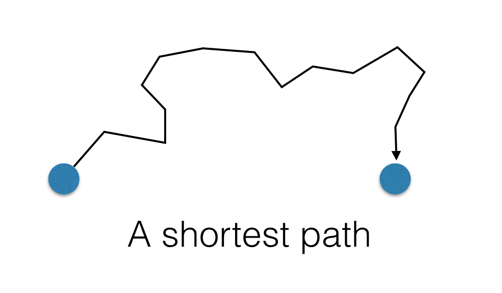
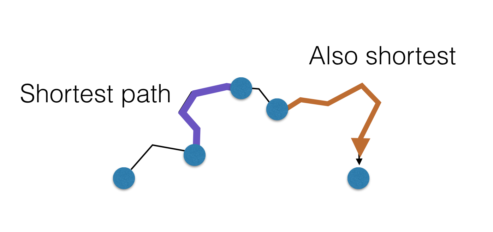
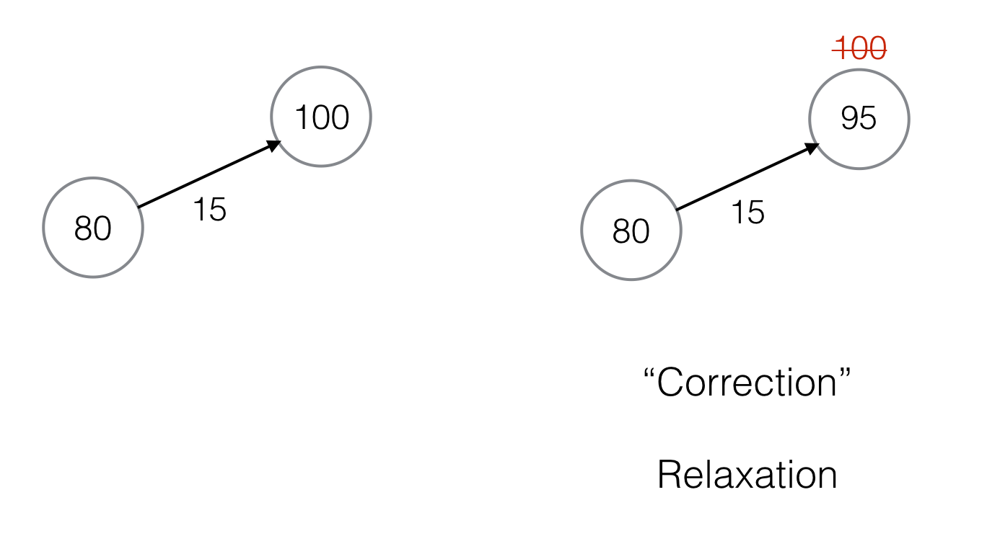

+++
slide = true
title = "Shortest path"
+++

# Shortest-path algorithms

[!](highlight)

- Bellman-Ford algorithm

- Dijkstra's algorithm


# Single-source shortest path

Let $G$ be a *directed* graph, with edge weights given by
$w:E(G)\to\mathbb{R}^+$.

Recall: a path `$p = \left<v_1, v_2, \dots, v_n\right>$` such that 
`$(v_i, v_{i+1})\in E(G)$`.

*Definition*: Shortest path

> The weight of a path is the sum of the weights of edges in $p$:
> 
> `$$w(p) = \sum_{i=1}^{n-1}w(v_i, v_{i+1})$$`
>
> A shortest-path from $u$ to $v$ is a path from $u$ to $v$ with the smallest
> possible weight.
>
> The distance from $u$ to $v$, $\delta(u, v)$, is the weight of a shortest
> path from $u$ to $v$.


# Properties of shortest paths

A path `$p = \left<v_1, v_2, \dots, v_n\right>$`
is a _shortest path_ if for all other paths $p'$ from $v_1$ to $v_n$ are such
that:

`$$ w(p)\leq w(p')$$`

[!](***)

*Theorem*:

If $p$ is a shortest path, any subpaths of $p$ is also a shortest path.

# ______________________

</img>

# ______________________

</img>


# The single source shortest path problem

*Problem*:

> Let $G$ be a graph, and $s$ a vertex in $G$.  We want to compute a tree $T$ from $s$
to all other *reachable* vertices $t$ in $G$ such that the tree-path from $s$
to $t$ is a shortest path from $s$ to $t$ in $G$


*Solution*:

> We want to encode the shortest paths tree as a predecessor function (as was done
> in BFS):
> 
> $$\pi: V(G)\to V(G)$$
> 
> Also, for each vertex $v$, we also compute the distance $\delta(s, v)$.
> 
> $$d : V(G)\to\mathbb{R} : v\mapsto \delta(s, v) $$

# Bellman-Ford Algorithm

- We also maintain an over-estimate of the distances initially.

- We use the edge weights to "correct" the estimates.

- Keep "correcting" the estimates until they cannot be reduced anymore.

- The final estimates guaranteed to be accurate.


# Initial over-estimates

```
# d: distance function
# parent: predecessor function

def initialize(G, s):
    N = len(G.nodes())

    for v in G.nodes():
        d(v) = N
        parent(v) = nil

    d(s) = 0
    parent(s) = nil

```

# Correction by "Relaxation"

</img>


# ________

```python
# G: the graph
# w: weights
# (u,v) is an edge

def relax(u, v):
    if d(v) > d(u) + w(u,v):
        d(v) = d(u) + w(u,v)
        parent(v) = u
        return True
    return False
```

# Putting it all together

The _Bellman-Ford_ algorithm:

```{python template}
def bellman_ford(G, w, s):
    d = dict()
    parent = dict()

    __initialize__(G, s)

    while True:
        modified = False
        for e in G.edges():
            (u, v) = e
            modified = __relax__(u, v) or modified
        if not modified:
            break

    return (d, parent)
```

# Complexity analysis

[!](columns 8:)

```{python sm nu template}
def bellman_ford(G, w, s):
    d = dict()
    parent = dict()

    __initialize__(G, s)

    while True:
        modified = False
        for e in G.edges():
            (u, v) = e
            modified = __relax__(u, v) or modified
        if not modified:
            break

    return (d, parent)
```

[!](split note)

Suppose $G$ has $V$ vertices and $E$ edges.

- $T_\mathrm{relax} = \Theta(1)$

- The inner loop (line 9-11) is $E\cdot\Theta(1) = \Theta(E)$

- For each iteration of the outer loop (line 7), at lease one more $d(v)$ will
  be accurate. (Why?)  Thus, there can be at most $V$ outer iterations.

Therefore, $T = \Theta(V\cdot E)$.

$E \leq V^2$, thus, $T = \mathcal{O}(V^3)$.


# Special case: DAG

If the graph is a DAG, then we can predictively select the _right_ edges to
instantly get the correct estimation.

```python
def DAG_shortestpath(G, w):
    d = dict()
    parent = dict()

    initialize(G, w)

    for u in topological_sort(G):
        for v in G.adjacency[u]:
            relax(u, v)

    return d, parent
```

[!](note)
The specialized Bellman-Ford algorithm runs in $\Theta(V + E)$.


# Dijkstra's Algorithm

As the DAG-Bellman-Ford algorithm demonstrates, careful selection of the edges
to relax will greatly speed up the shortest path construction.

Dijkstra's observations:

- A vertex that has the _lowest_ estimate is _correct_.


# _______________________________


```python
def dijkstra(G, w):
    d = dict()
    parent = dict()
    initialize(G, w)
    Q = sorted(G.nodes, key=d)
    while len(Q) > 0:
        u = Q.pop(0)
        for each v in G.adj[u]:
            relax(u, v)
            reorder(Q, v) # can be done in log(n)-time.
```

# _________________________________

[!](columns 6:)

```{python sm nu}
def dijkstra(G, w):
    d = dict()
    parent = dict()
    initialize(G, w)
    Q = sorted(G.nodes, key=d)
    while len(Q) > 0:
        u = Q.pop(0)
        for each v in G.adj[u]:
            relax(u, v)
            reorder(Q, v)
```

[!](split note)

- There are $V+E$ iterations of (line 9-10).

- The total complexity is therefore: $\Theta((V + E)\log(V))$.


# Summary

[!](highlight)

The problem is finding single-source shortest paths in a directed graph $G$.

1. Bellman-Ford algorithm is $\Theta(V^3)$ in general.

2. If $G$ is a DAG, then modified Bellman-Ford can run in $\Theta(V + E)$.

3. Dijkstra's algorithm is $\Theta((V+E)\log(V))$ in general.


