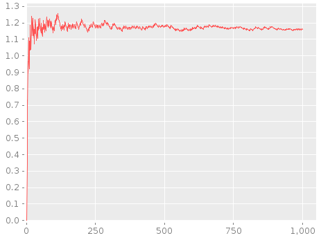
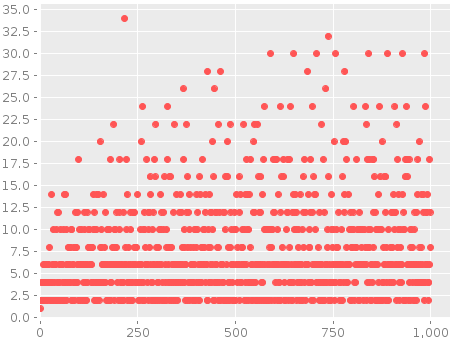

+++
slide = true
title = "Clojure 3"
+++

# Clojure Part III

[!](highlight)

# Data Read & ~~Write~~ & Transformation

- List

- Vector

- (Hash-) Map

- Set

# List

Create

> - `(...)`
> - `(list ...)`

Read

> - `(first seq)`
> - `(nth seq n)`

Transformation

> - `(cons elem seq)`
> - `(conj seq elem ...)`
> - `(rest seq)`

# Vector

[!](columns 6:)

Create

> - `[ ... ]`
> - `(vector ...)`
> - `(vec seq)`
> - `(into v seq)`

Read: Vectors are _functions_.

> - `(v n)`
> - `(get v n)`
> - `(nth v n)`, `(first ...)` still apply.

[!](split)

Transformation

> - `conj`, `cons`, `rest` still apply.
- `(assoc v n val)`
- `(update v n func)`
- `(subvec v start end)`
- `(replace map v)`

# (Hash-) Map

[!](columns 6:)

Create

> - `{ ... }`
- `(hash-map ...)`
- `(array-map ...)`

Read: maps are functions, and keywords are functions!!

> - `(m key)`
- `(:keyword m)`
- `(get m key default-val)`
- `(keys m)`
- `(vals m)`
- `(contains? m key)`

[!](split)

Transform

> - `(assoc m key val)`
- `(assoc-in m [path] val)`
- `(dissoc m key)`
- `(merge m1 m2 ...)`
- `(merge-width f m1 m2 ...)`
- `(select-keys m [keys])`
- `(update m key func)`
- `(update-in m [path] func)`
- `(rename-keys m rename-map)`

# Sequences

[!](highlight)

# Sequences

- Think of it as another data structure, known as _seq_.
- The closest thing we have seen is _Iterable_ in Java.

[!](------)

Seqs gets the most amount attention in Clojure.

# Sources of seqs

```clojure
(range <start> <end> <step>)
```

[!](note) Creates a sequence of integers.

```clojure
(repeat <n> <x>)
(repeat <x>)
```

[!](note) Creates a sequence of the same value `x` repeately `n` times.  If `n`
is omitted, the sequence continuous forever.

```clojure
(iterate <f> <x>)
```

[!](note) A sequence with: `x` `(f x)`, `(f (f x))`, ... _forever_.

```clojure
(repeatedly <n> <f>)
(repeatedly <f>)
```

[!](note) A sequence with: `(f)`, `(f)`, ... $n$ times.  If $n$ is omitted, the
sequence continuous forever.

```clojure
(cycle <collection>)
```

[!](note) Generates an infinite sequence of by repeating the collection forever.

# More sources of seqs

## Readers:

```clojure
(clojure.java.io/reader <filename>)
```

## Creating a sequence of lines

```clojure
(line-seq <rdr>)
```

---

### Note

Don't forget to close the reader when you are done.  To be safe, use the macro:

```{clojure sm}
(with-open [rdr (clojure.java.io/reader <filename>)]
  (let [lines (line-seq rdr)]
    ...))
```

[!](note) The `with-open` macro will create the symbol binding to the opened
reader, and close it afterwards.

# Even more sources of seqs

## Regular expression

```clojure
#"..."
```

[!](note) Clojure relies on Java's regular expression library.  So the syntax
for regular expressions is the same as Java's `java.util.regex` library.  But
creating a pattern is really simple with the reader macro `#"..."`

## Sequences of matches

```clojure
(re-seq <pattern> <string>)
```

[!](note) Returns a sequence of matches of pattern in the string.  If the
pattern does **not** contain groups, then each match is a string.  Otherwise,
it's a vector containing the groups.

# Working with seqs

<div style=height:150px></div>

## _Fast and furious_

# Working with seqs

```{clojure clipboard}
(def nat (iterate inc 0))
```
[!](note) Defining natural numbers.  This is an infinite sequence, so `(println nat)` will result in a
never-ending loop.

```{clojure clipboard}
(def nat+ (rest nat))
; (1 2 3 4 5 ... ∞)
```
[!](note) Strictly positive numbers


```{clojure clipboard}
(first nat)   ; 0
(first nat+)  ; 1
```
[!](note) Getting the first element


```{clojure clipboard}
(take 10 nat)
; (0 1 2 3 4 5 6 7 8 9)
```
[!](note) Takes the first 100 natural numbers.


# Working with seqs

```clojure
(interleave <seq1> <seq2>)
```
[!](note) Mix two sequences into one by interleaving the elements.

```clojure
(interpose <x> <seq>)
```
[!](note) Insert `<x>` between the elements in `<seq>`.


```clojure
(split-at <index> <seq>)
```
[!](note) Returns a vector containing _two_ seqs.  The two seqs are produced by
splitting the input `<seq>` at the `<index>`.


# Higher order functions with seqs

```clojure
(map <fn> <seq>)
```
[!](note) Returns a sequence by applying `(<fn> x)` for each `x` in `<seq>`.

```clojure
(map <fn> <seq-1> <seq-2>)
```
[!](note) Returns a sequence by applying `(<fn> xi yi)` for each `xi` in `<seq-1>` and `yi` in `<seq-2>`.


```clojure
(filter <pred> <seq>)
```
[!](note) The function `<pre>` is a _predicate_, namely a function that always
returns `true/false`.  The returned seq contains elements <br>
`x$\in$<seq>` that satisfies the
predicate, i.e. `(<pred> x)` is true.

```clojure
(reduce <f> <seq>)
(reduce <f> <x0> <seq>)
```
[!](note) Reduces a sequence (x1 x2 x3) to a single value of <br>
`(f (f (f x0) x1) x3)`.


# More higher order functions on seqs

```clojure
(take-while <pred> <seq>)
```
[!](note) Takes elements `x` from `<seq>` for as long as `(<pred> x)` is true.


```clojure
(drop-while <pred> <seq>)
```
[!](note) Drops elements `x` from `<seq>` for as long as `(<pred> x)` is true.
Returns the remaining elements.


```clojure
(split-with <pred> <seq>)
```

[!](note) Returns a vector of two seqs.  The first is `(take-while ...)` and the
second is `(drop-while ...)`.


# Predicates on seqs

```clojure
(every? <pred> <seq>)
```
[!](note) Tests if _pred_ holds for every element of the seq.

```clojure
(some <pred> <seq>)
```
[!](note) Returns the first element in seq that satisfies the predicate.
It can be used to test if _pred_ holds for some element of the seq.

```clojure
(not-every? <pred> <seq>)
```
[!](note) Test that predicate is violated by some elements in seq.

```clojure
(not-any? <pred> <seq>)
```
[!](note) Test that none of the elements in seq satisfies the predicate.


# Transformations of seqs

```clojure
(sort <seq>)
(sort <cmp> <seq>)
```
[!](note) Sorts the seq by an optional comparator.

```clojure
(sort-by <key-fn> <seq>)
(sort-by <key-fn> <cmp> <seq>)
```
[!](note) Sorts the seq by `(<key-fn> x)` instead of the elements `x`.

```clojure
(reverse seq)
```
[!](note) Reverses the sequence.

# Seq in action

```{clojure clipboard}
(def nat (iterate inc 0))
```

```{clojure clipboard}
(defn even? [n] (zero? (mod n 2)))
```

# Seq in action

```{clojure clipboard}
(def even-nat (filter even? nat))
```

```{clojure clipboard}
(def odd-nat (filter #(not (even? %1)) nat))
```

```{clojure clipboard}
(take 4 even-nat)       ; (0 2 4 6)
(take 4 odd-nat)        ; (1 3 5 7)
```

```{clojure clipboard}
(interleave odd-nat even-nat)
; => (1 0 3 2 5 4 7 6)
```

# Seq in action

```{clojure clipboard}
(defn prime? [n] (not-any? (fn [i] (zero? (mod n i))) (range 2 n)))
```

```{clojure clipboard}
(def primes (filter prime? (drop 2 nat)))
```

```{clojure clipboard}
(take 100 primes)
```

Questions:

> 1. Does the gap between two adjacent primes grow?
> 2. How many primes $\leq n$ are there for growing n?

# Tricks & Magic

## The trick

```{clojure clipboard}
(def letters [\a \b \c])
(def numbers [ 1  2  3   4  5  6])
(map vector letters numbers)
; => ([\a 1] [\b 2] [\c 3])
```

## The magic

```{clojure clipboard}
(def prime-gaps
  (map #(apply - (reverse %)) (map vector primes (rest primes))))
```

# Tricks & Magic

```{clojure clipboard}
(defn count-primes [n] (count (take-while #(<= % n) primes)))
```

```{clojure clipboard}
(def prime-counts (map count-primes nat))
```

[!](&&&)

Theorem:

> The distribution of primes is $\Theta(n/\log n)$.

[!](&&&)

```{clojure clipboard}
(defn g [n] (if (> n 1) (/ (float n) (Math/log n)) 1))
(def alpha (map #(/ %1 (g %2)) prime-counts nat))
```

# A preview of the leverage on JVM

You need to include `incanter.jar` in the CLASSPATH to run the following code.

```{clojure sm clipboard}
(use '(incanter core charts))
(let [ds (conj-cols (take 1000 nat) (take 1000 alpha))]
  (view (xy-plot 0 1 :data ds)))
```

</img>

# More sorcery

```{clojure sm clipboard}
(view 
  (scatter-plot 0 1 
                :data (conj-cols 
                        (take 1000 nat) 
                        (take 1000 prime-gaps))))
```

</img>

# In one fell swoop

```{clojure sm clipboard}
(use '(incanter core charts))
(let [; list of natural numbers
      nat (iterate inc 0)
      ; a predicate to decide of input is prime
      prime? (fn [n] 
               (not-any? 
                 (fn [i] (zero? (mod n i))) 
                 (range 2 n)))
      ; list of primes
      primes (filter prime? nat)
      ; compute the gaps between to adjacent primes
      gaps (map 
              #(apply - (reverse %))
              (map vector primes (rest primes)))
      ; counts the number of primes less than n
      countp (fn [n] (count (take-while #(< % n) primes)))]
    ; plots
    (view (scatter-plot 0 1 :data (conj-cols (take 1000 nat) (take 1000 gaps))))
    (view (xy-plot 0 1 :data (conj-cols (take 1000 nat) 
                             (map #(* (Math/log %) (/ (countp %) (float %)))
                                  (take 1000 nat))))))
```

# Summary

[!](highlight)

- Data
- Data transformation
- Sequences
- Sequence (higher-order) functions


