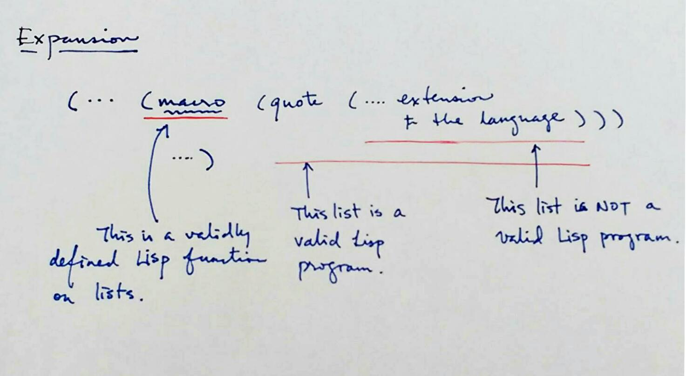
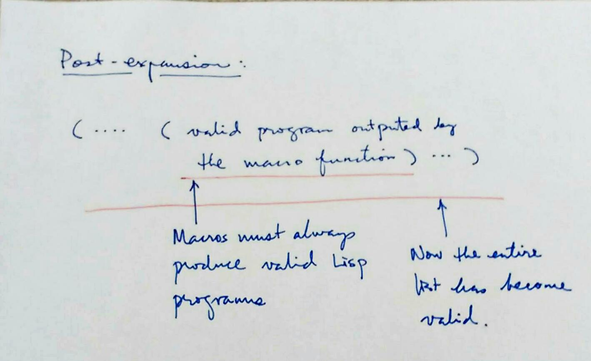

+++
slide = true
title = "Clojure: the language"
+++

# Clojure: Part I

[!](highlight)

- Life cycle of Lisp code
- Raw basics
- Syntactic sugars

# Review of Lisp

- A program is a (nested) list.

- Not all lists are valid programs.  Only certain type of lists can be interpreted as programs.

	- Valid: `(+ 1 2 (* 3 5))`

	- Invalid: `(1 2 +)`

- Sometimes the validity of a list depends on the dialect of Lisp:

	- `(defun add (a b) (+ a b))`

		> Valid for _Common Lisp_, but not _Racket_.

	- `(define (add a b) (+ a b))`

		> Valid for _Racket_, but not _Common Lisp_.

# Lifecycle of lists in Lisp

The unified representation of programs using a data structure that programs can manipulate, Lisp has a uniquely self-referencial nature that makes it exceedingly powerful (and intellectually challenging).

[!](box) <i style=font-size:200%;vertical-align:middle class="fa fa-bolt"></i> Lisp rewrites itself, and it *grows* by itself.

# Two-phase compilation



[!](note 3) During expansion, functions, known as _macros_, evaluate certain fragments in the program.  These fragments are the extensions to the language.

# Two-phase compilation

[!](columns 7:)	



[!](split note)

The macro functions converts the entire nested list to a valid Lisp program.

```{lisp sm}
(... (macro (quote (... invalid-list ...))))
```

gets evaluated to:

```{lisp sm}
(... (... valid-list ...))

```

# Core Clojure

[!](highlight)

- List-only core syntax (low-level and verbose)
- (Sensible) syntactic extensions
- Tons of macros

# Clojure

**Definition:** (Atoms)

> An _atom_ is a value that can be an element of a list.

[!](&&&&&&)

Let's go through the different atoms of the core-clojure langauge.

# Numbers

| Numbers | Example |
|-------------|----------|
| Long numbers | `3.1415` |
| Ratio        | `1/3`    |
| BigInt       | 10000N   |
| BigDecimal   | 3.1415M  |

# Strings

Simple strings:

```
"Hello world."
``` 

```
"I say \"Hello\" to the world"
```

Multiline string:

```clojure
"Hello,
This is a big world of long
sentences."
```

## Character

```
\a
```

# Keywords

Keywords are a staple of Clojure programs.  They are quick and efficient way to create _constants_.
They are similar to the Java `enum` values.

[!](columns 8:)

Keywords have the same rule as variable names (aka _symbols_), except they must start with `:`.

```
:red
:blue
:green
```

or

```
:big-red-apple
:blue-sky
:important-field!
```

[!](split note)

Later, we will introduce namespaces.  Like symbols, keywords can be specialized by a namespace.

# Symbols

Symbols are variables which are labels referring to some data or function.

> [!](note) It's natural to think of Clojure symbols as variables.  But Clojure can do *more* with its symbols than other languages can do with variables.

Clojure has some very relaxed rules in naming symbols:

```{clojure sm}
a                 ; looks like a variable.
*a*               ; can have (almost) any characters except whitespaces
int->float        ; good names can be extremely satisfying
java.lang/Integer ; a symbol that has a namespace "java.lang", and name "Integer"
```

# More about symbols

*Var* s are symbols which represent other expressions

~~~{nosyntax}
a => 42
~~~

(Almost) each time a *var* appears, it is evaluated to its expression.

**Other languages**

In other programming languages, one can *only* access the expression referred by variables.

**Lisp**

In Lisp, we can (and need) to access (and create) the variable *itself* using Lisp.

~~~{clojure sm}
(var a)
~~~

# Beyond parentheses in Clojure

Clojure uses other brackets to improve the parentheses overload.

[!](columns 6:)

```lisp
(let ((a 10)
      (b 20))
  (+ a b))
```

[!](note) Common Lisp

[!](split)

```clojure
(let [a 10
      b 20]
  (+ a b))
```

[!](note) Clojure

# Lambda Calculus in Clojure


We will focus on the core Clojure - which is a Turing-complete implementation of Lambda Calculus.

[!](&&&)

- [!](comfort)
- Function application
- Function abstraction
- Symbol binding

# Function application

~~~clojure
(f <arg> <arg> ...)
~~~

Example:

```clojure
(+ 1 2 3 4)
(/ (+ 1 2 3 4) 4.0)
```

# Function Abstraction

~~~{clojure}
(fn <alias?> [ <args> ] <body>)
~~~

Example:

```{clojure}
(fn [a b] (/ (+ a b) 2))
```

[!](note) Computing the average of two numbers.

```clojure
(fn factorial [n]
  (if (< n 2) n (* n (factorial (dec n)))))
```

[!](note) Recursion function that uses an alias `factorial` for itself.  The alias is only valid in the body of the `fn` defintion.

# Symbol binding

Symbols are just names, and they can be used to represent anything, such as:

1. expressions
2. functions
3. variables
4. lists (or programs)

---

**Definition**: _Symbols Binding_

> When we associate a symbol to something else, the *association* is called a _binding_.

# Symbol binding

<span style=color:red>Insert diagram here</span>

# Global symbol binding

~~~clojure
(def <symbol> <expression>)
~~~

[!](note) Creates a global symbol binding that exists throughout the entire _namespace_.

More on _namespaces_ later...

[!](---)

*Example*:

> ~~~clojure
(def PI 3.1415)
~~~

> ~~~clojure
(def area-of-circle (fn [r] (* r r PI)))
~~~

> ~~~clojure
(area-of-circle 100)
~~~

# Global symbol binding

- Must resist the usage of global symbol binding.

	> Java/C/C++ tend to bind functions to global symbols.

- Because functions are values, think of functions as simple as _integers_.
  So, Clojure requires minimal global symbol binding.

- Use _local binding_ (coming up next) as much as you can.

# Local symbol binding

We want to create new symbol bindings in expressions _on-the-fly_.

<pre><code class="lang-nosyntax" data-noescape>(def two-circles
  <span style="color:#944;
  				border:thin solid #888;
  				padding:5px;
  				margin:5px;
  				font-weight: bold;
  				display:inline-block">(+ (* 3.1415 100 100) (* 3.1415 100 100))</span>)
</code></pre>

[!](note) Let's create a symbol bindings which are _only_ valid in the inner-expression.


## <span style=color:red>BAD IDEA</span>

```clojure
(def PI 3.1415)
(def radius 100)
(def area (* 3.1415 radius radius))
(def two-circles (+ area area))
```

> [!](note)
> Why is it bad?
>
> - `radius` is not really a universal constant.  It's 100 only for this expression.
> - same for area.

# Local Symbol Binding

```clojure
(...
  (let [<symbol> <expression>
        <symbol> <expression>
        ...]
    <inner-expression>) ...)
```

[!](&&&)

*Example*:

```clojure
(def PI 3.1415)
(def two-circle
  (let [r    100
        area (* PI r r)]
    (+ r r)))
```

[!](note) Can you summarize why local symbol binding is more desirable to compute the value of `two-circle`?

# Summary

[!](highlight)

- Atoms
- Lists as code and code as lists
- Functions
- Invocation of functions
- Symbol bindings (global v.s. local)

