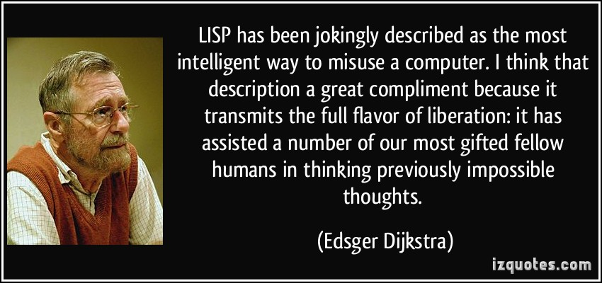
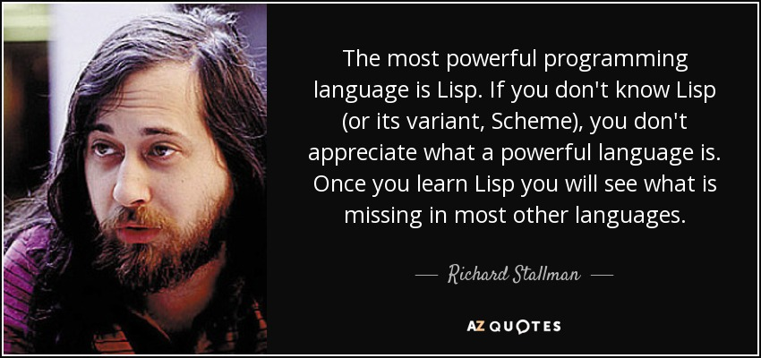

+++
slide = true
title = "From Lisp to Clojure"
+++

# From Lisp to Clojure

[!](highlight)

Lisp

> - Inspired by $\lambda$-Calculus
> - Hyper-productive syntax

Clojure

> - Extension to Lisp
> - Supports a slightly richer set of syntactic sugars for readability
> - Runs on JVM

# Lisp

- Invented by John McCarthy, 1958

- It's been the foundation of A.I. research ever since.

# Lisp

</img>

# Lisp

</img>

# Review of LC

[!](columns 6:)

## Abstraction

$\lambda x. e$

> Example:
>
>
> $\lambda x.\lambda y. x+y$ 
>
> $\lambda xy. x+y$ (with syntactic abbreviation)

[!](split)

## Application

$(e_1 e_2)$

> Example:
>
> $(((\lambda xy. x+y)\ 1)\ 2)$
>
> $((\lambda xy. x+y)\ 1\ 2)$ (abbreviation)

*Observation*:

Application is always a **list** of expressions.  The first expression is the function, and the rest of the list is arguments.


# Design of Lisp

LISP = <span style=color:red>LIS</span>t <span style=color:red>P</span>rocessing

- [!](comfort)
- Function applications are _lists_.
- Unless specified, lists are treated as function applications.
- As few additions to LC as possible while still making it humanly usable.

---

Results:

> 1. The entire language only needs one data structure: lists.
> 2. Simplicity kicks ass.

# From Lisp to Clojure

> <i>Simplicity is hard work. But, there's a huge payoff. The person who has a genuinely simpler system - a system made out of genuinely simple parts, is going to be able to [e]ffect the greatest change with the least work. He's going to kick your ass. He's gonna spend more time simplifying things up front and in the long haul he's gonna wipe the plate with you because he'll have that ability to change things when you're struggling to push elephants around.</i>
>
> <div style=float:right>Rich Hickey, Inventor of Clo<i>j</i>ure</div>

[!](--------)

[!](columns 4:)

<div style=font-size:300%>Why Clojure?</div>

[!](split)

- Dialect of Lisp
- Runs on JVM with native execution speed of Java
- Natively access Java libraries (huge deal)
- Ported to Javascript -- powers the front-end with React.js

# Homoiconic Languages

Every language must support data structures:

- C:

	> Arrays: `(char*)[] names`
	> Structures: `struct { char *name; }`

- Javascript:

	> JSON: `{name: "Jack", age: 39}`

- Lisp:

	> (Nested) Lists: `(1 (2 3) (4 (5 6 7)))`

---

**Data**

> Given a language $L$, let $\mathbf{D}(L)$ be all possible data structures that can be represented by the language.

# Homoiconic Languages

Every language must support a (sometimes VAST) collection of programming constructs:

- C:

	> `for(int i=0; i < 10; i++) { ... }`

- Rust:

	> `fn foo(v1: Vec<i32>, v2: Vec<i32>) -> Vec<i32> {...}`

- Lisp:

	> (Nested) lists: `(when (nice weather) (go outside))`

---

**Program**

> Given a language $L$, let $\mathbf{P}(L)$ be all possible (valid) programs that can be constructed in the langauge.

# Homoiconic Languages

**Definition**

[!](columns 8:)

A language $L$ is homoiconic if:

$$ \mathbf{P}(L) \subseteq \mathbf{D}(L) $$

[!](split note)

> Make sure you understand this property.
>
> It means that a homoiconic language can always digest its own program as data, and treat its data as programs.

# Backbone of Lisp: S-expressions

S-expressions can be two things:

1. Nested lists, or
2. A completely valid Lisp program.

---

Atoms:

> _Atoms_ are values such as strings, characters, numbers or symbols.


Lists:

> A bracket enclosed, whitespace separated list of elements.  Each element can
> be an atom or a list.

S-expression:

> A _s-exp_ is a list.


# S-expression

```{cfg}
s-expr    : '(' expr-list ')'

expr-list : elem expr-list
          | <Empty>

elem      : s-expr
          | <Atom>
```

[!](note) This summarizes the Lisp syntax.

# S-expressions as syntax


S-expressions are so simple that designing programming constructs with with becomes *obvious*.

> - [!](comfort)
- Declaring a function
- Declaring a variable (this is done with a more general mechanism known as _name binding_).
- Invoking (evaluating) a function with given parameters
- When a list is just a list
- Flow control

# S-expressions as function declaration

[!](columns 6:)

Recall in LC:

$$\lambda xyz. \left<\mathrm{expression}\right>$$

Here, we need a function name.

$$\left<\mathrm{name}\right> := \lambda xyz. \left<\mathrm{expression}\right>$$

[!](split)

Turning it into a S-expression:

```lisp
(defun <name> ...)
```

Treat the parameters as a list

```lisp
(defun <name> (x y z) <body>)
```

This approach of encoding function declaration to s-expressions is used by _Common Lisp_.

# Dialects

```lisp
(define (<name> x y z) <body>
```

Note the function name is grouped together with the parameters.  This approach is used by _Racket_ (formerly known as _Scheme_).

# Name binding

```
(define PI 3.1415)
```

# Local name bindings

Create a _scope_ with a new nested list:

~~~lisp
(let ...)
~~~

Create additional "local" variables in the scope:

~~~lisp
(let ((x <expression>)
      (y <expression>)) <body>)
~~~

[!](note) This is the syntax of Common Lisp.


# Function invocation

Because this is considered to be the _most_ frequently used programming construct, it is represented simply by a list.

```lisp
(<name> <expression> <expression> ...)
```

# When a list is just a list

What if we really mean to represent a list of elements?

```lisp
(quote (<element> <element> ...))
```

[!](note) This suppresses the inner list as function evaluation.

# Branching

```lisp
(if <test> <when-true> <when-false>)
```

The `if` start of a list indicates that it is a branching form.

- It can only have four elements.
- The second element, `<test>`, is the condition.
- The third element, `<when-true>`, is evaluated if the condition is true.
- The fourth element, `<when-false>`, is evaluated if the condition is false.

# Rolling up the sleeves

Let's flex the **power** of simplicity.

1. We have only been dealing with lists.
2. Some lists start with distinct names, like `define`, `let`, `if`.
3. Some nesting of lists needs to be respected, like grouping the parameters as a nested list.

[!](------)

**Challenge**

> Compute the factorial of 100.

# Rolling up the sleeves

**Challenge**

> Compute the factorial of 100.

[!](columns 6:)

```{lisp sm clipboard}
(define (factorial n)
  (if (< n 2) 
    n 
    (* n (factorial (- n 1)))))
```

[!](split)



# Moving on from Lisp to Clojure

Lisp is _simple_ (and thus powerful) in syntax.  At the same time, it's also simple in terms of the data structure it can support.  No native support for vectors (dynamic list with random access), hash-maps (associative collections), sets (list without order or multiplicity), ...

[!](-----)

[!](columns 6:)

Clojure is *Lisp*:

> Clojure faithfully minimizes syntax by sticking with s-expressions for programming constructs, so it remains _homoiconic_.

[!](split)

Clojure extends *Lisp*:

> It adds more syntax (YES...) to support a richer _data_ constructors for vectors, hash-map etc...  It also support even more succinct definition of functions.

# Clojure at a glance

```{clojure sm clipboard}
(defn f [n] (if (< n 2) n (* n (f (dec n)))))
```

[!](note) The `dec` function decreases an integer by 1.  You might want to know about `bigint` function which converts an integer to a BigInteger, when computing the value `(f 100)`.



# Clojure at a glance

```{clojure sm clipboard}
(import java.util.Vector)
(let [v (java.util.Vector. (quote (1 2 "blah")))]
  (println "Last element =" (.lastElement v)))
```

[!](note) Wow, we are converting a Lisp list `(1 2 "blah")` to a Java vector object, and using the method `java.util.Vector.lastElement` to access the last element.  ... **And we are still just using nested lists.**




# Looking ahead

- We will *not* use Common Lisp, nor Scheme, nor Racket for this course.
- We will explore Clojure into great detail instead.
- [!](comfort)

# Summary

[!](highlight)

- Once we have lists, we immediately have an entire programming language. 

	> All variations of PL based on (nested) lists are referred to as Lisp.

- Clojure is a particularly attactive Lisp as it can immediately tap into the vast ecosystem of Java libraries.
