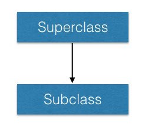

+++
slide = true
title = "Scala Types"
+++

# Classes

```{scala template}
class __Name__(__args__) {
    __computation__

    val __field__ = ...
    var __field__ = ...

    def __method__(__args__...): __Type__ = {
        ...
    }
}
```

[!](note)
A class definition can be parametersized by arguments, and it can contain
computation and declaration of the content of the class, including members and
methods.

# Example

```scala
class Student(_name:String, _year:Int) {
    var grade = 0.0f
    val name = _name
    var year = _year

    def report():String = s"${name} in ${year} has grade ${grade}"
}
```

# Members declaration

Very often, the arguments are used to initialize members of the class.
Scala allows you to *declare* the members as part of the arguments.

```scala
class Student(val name:String, var year:Int) {
    var grade = 0.0f
    def report() = s"${name} in ${year} has grade ${grade}"
}
```
[!](note 3) We can omit the return value of `report` thanks to type inference.

# Constructors

Scala supports multiple constructors in addition to the _primary_ constructor.

```{scala template}
class __Name__(...) {
    def this(__args__...) {
        __code__
    }
    ...
}
```

# Example

```scala
import java.util.Calendar

class Student(val name:String, var year:Int) {
    def this(name:String) {
        this(name, Calendar.getInstance().get(Calendar.YEAR))
    }

    var grade = 0.0f
    def report() = s"${name} in ${year} has grade ${grade}"
}
```

# Hierarchy

```{scala sm template}
class __Subclass__(__args__...) extends __Superclass__(__args__...) {
    ...
}
```
> [!](note 3) </img>

# Example

```{scala sm}
class Student(val name:String, var year:Int) {
    def this(name:String) {
        this(name, Calendar.getInstance().get(Calendar.YEAR))
    }
    var grade = 0.0f
    def report() = s"${name} in ${year} has grade ${grade}"
}
```

We can extend the hierarchy with a subclass.

```{scala sm}
class GradStudent(
        name: String, 
        year: Int, 
        val degree: String, 
        var office:String)
    extends Student(name, year) {
    override def report() = {
        super.report + "\n" + 
        "... studying towards ${degree}"
    } 
}
```

# ______

- All objects of `GradStudent` can be used as `Student`

- Dynamic dispatching

    > The exact method to be invoked is determined by the _object_ (at runtime) that
    > the symbol is bound to, not by the type of the symbol.

---

Try this out:

```{scala sm}
val jack: Student = new GradStudent("Jack", 2016, "MSc", "UA2001")
println(jack.report)
```

[!](note 3) Make sure you understand the output.  Note that Scala is performing
dynamic dispatching.

# Abstract classes and methods

```{scala template}
abstract class __Name__(...) {
    val __field__: __T__  // abstract fields don't have to be initialized.
    def __method__(...): __T__ // methods without body are abstract
}
```

# Example

```scala
abstract class Person {
    val name: String
    def report(): String
}
```

---

```scala
class Student(val name: String, var year:Int)
    extends Person {
    ...
}
```

# __________

Abstract class can have a primary constructor.

```scala
abstract class Person(val name:String) {
    def report(): String
}
```

---

```scala
class Student(name: String, var year:Int)
    extends Person(name) {
    ...
}
```

# Limitation of abstract classes

Each class can only extend at most *one* class.

This causes problems in modeling real-life scenarios:

> Anyone employed by the university will need to have an office, and a method to
> help students.

How do we model this?

# A failed attempt using abstract class

```scala
abstract class Staff {
    var office: String
    def help(Student s)
}
```

We would like to do the following:

```scala
class TA(...) extends GradStudent(...), Staff {
    override def help(Student s) = {
        ...
    }
}
```

But this is *not* allowed by Java nor Scala.

[!](note) Can you use Java's interface instead?  (No)

# Traits

Traits are _purely_ passive description of a blueprint (classes).

They generalize interfaces:

1. Traits can carry implemented methods.
2. Traits can describe members.
3. Traits can be applied at object construction.

# ______

```{scala template}
trait __Name__ {
    __member_definition__
    def __method__(...): T  // abstract method
    def __method__(...) = { // method with default implementation
        ...
    }
}
```

# Example

```scala
trait Staff {
    var office: String
    def help(Student s)
}
```

All traits can be used as an abstract class.

```scala
class Professor(var office:String) extends Staff {
    override def help(Student s) {
        println("""My office hour is:
        | Tuesday 2-3pm, and my email is
        | Albert.Einstein@gmail.com
        | Please bring your questions with you.""")
    }
}
```

# ________

But multiple traits can be applied using the `with` construct.

- at class definition, and
- at object construction.

# _______________

Class definition with traits

```scala
class TA(office:String, name: String, year: Int, degree: String) 
    extends GradStudent(name, year, degree, office)
    with Staff {
    def help(Student s) {
        println("Hi ${s.name}, what's your problem?")
    }
}
```

# ______________

Object construction with traits

```scala
var jack = new GradStudent("jack", 2016, "MSc", "UA2001") with Staff
```

- Jack has a `GradStudent` has an office (as required by `Staff`),
- Jack does not the method `help(Student)` but that's okay because `Staff`
  provides a default implementation.

```
jack.help(jack)

> "Hey"
```

# Multiple traits

Recall that all `Person` can generate a report by the method `def
report():String`.

What if we want to apply special formats to their reports?

For example: 

> 1. convert the report to uppercase
> 2. apply spellchecking
> 3. apply richtext formatting

We can use traits.

- Each "feature" is a trait.
- Each trait has its own `def report:String` method that relies on the
  implementation of its _superclass_.
- Each trait needs to extend `Person`.

# Example

```{scala template}
trait Uppercase extends Person {
    __abstract__ __override__ def report: String = {
        val s = super.report
        s.toUpperCase
    }
}
```

[!](note) The `abstract` informs Scala that the eventual implementation belongs
to the object of the class that has this trait.  The `override` method states
that it's modifying the underlying method.

---

```{scala}
trait Richformat extends Person {
  abstract override def report: String = {
        val s = super.report
        "<html><i><b>" + s + "</b></i></html>"
    }
}
```

# ____

Now we can do some really cool _mixins_.

[!](note) The ability to inject traits to a class is called mixins.

```scala
var jack = new GradStudent("jack", 2016, "MSc", "UA2001") 
            with Staff
            with Uppercase
            with Richformat
```

---

Compare this with:

```scala
var jack = new GradStudent("jack", 2016, "MSc", "UA2001") 
            with Staff
            with Richformat
            with Uppercase
```

# Linearization

Traits are applied one after another in a sequential fashion - think of them as
layers of an onion.

This is called linearization of trait mixins.


