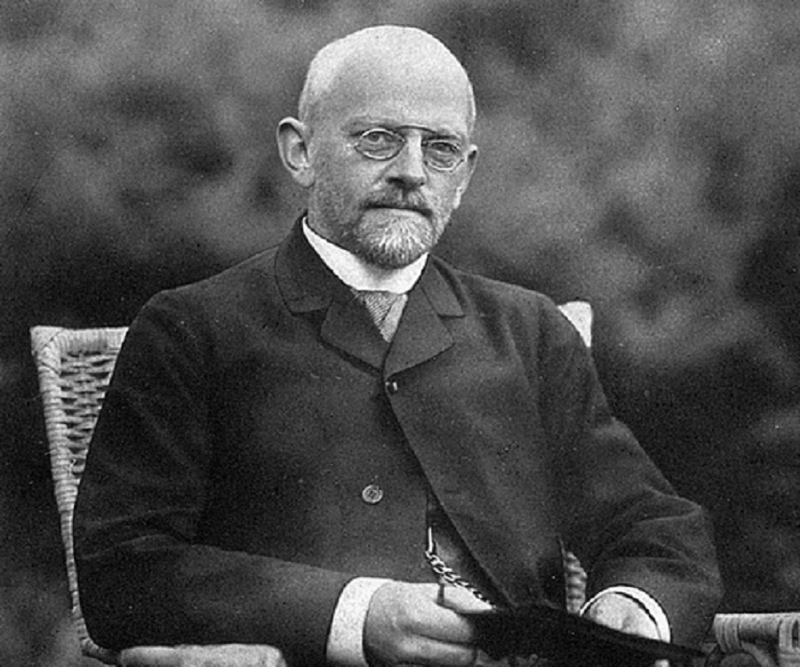
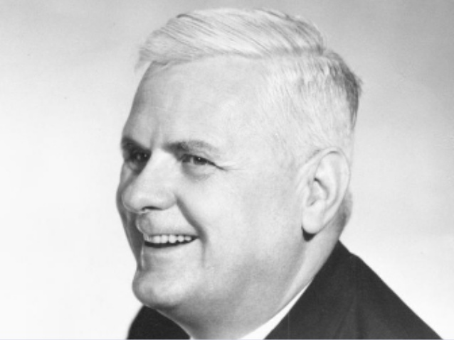
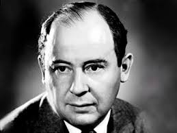

+++
slide = true
footnote = "Programming Languages, Ken Pu"
+++

# Computation & the Turing Machine

[!](highlight)

# Computation

[!](columns 5:)

</img>

[!](split)

- Hilbert's Ten's problem, 1900
- Entscheidungsproblem, 1928

# Computation

[!](columns 5:)

</img>

[!](split)

- Entscheidungsproblem, 1928
- Gödel's incompleteness theorem

# Computation

[!](columns 5:)

</img>

[!](split)

- Entscheidungsproblem, 1928
- Turing machine

# Computation

[!](columns 6:)

</img>

[!](split)

- Entscheidungsproblem, 1928
- $\lambda$-calculus

# Computation

[!](columns 6:)

</img>

[!](split)

- von Neumann computing model
- EDVAC

# Turing Machine

1. A completely mechanical device (1928)

    > envisioned by Alan Turing as an intuitive formalism to
    > describe the non-existing phenomenon of machine driven
    > reasoning, now known as *computation*.

2. Realized into an actual design (1945)

    > John von Neumann designed an electronic version to simulate
    > the mechanical definition of a TM in a document known as *First Draft of a
    > Report on the EDVAC*, 1945.

3. Turing-complete

    > TM is the most powerful computing model we know.
    > Up to now, we don't know any other computing models more powerful than
    > a TM.

# Turing Machine

# Computational power of TM

*Church-Turing Thesis*

> If a procedure (algorithm) can be executed by *any* computer, then it can be
> executed by a Turing Machine.

---

*Turing Complete*

> If a mechanism is equivalent to TM, then it's called _Turing Complete_.

# Simulation of a function

[!](columns 8:)

*Computable functions*

> A function $f$ is computable if:
> 
> - Its input can be encoded as a binary string: `$2^*$`
> - Its output can be encoded as a binary string: `$2^*$`
> - Its evaluation can always be carried out by a TM.

[!](split)

1. Any computable function can be implemented by a TM.

2. Any TM is some computable function.

    > _Why is a TM always a function (over binary strings)?_

[!](break)

# Universal TM

Consider a TM: $M$.

1. It's a function `$M:2^*\to 2^*$`

2. It's mechanical description can be encoded as a binary string. 
    <i style="font-size:200%;color:#faa;vertical-align:middle;margin-left:10px" class="fa fa-thumbs-up"></i>

---

[!](columns 6:)

Function *eval* takes two inputs - a TM and an input, and it computes the
output.

$$\mathrm{eval} :\mathrm{TM} \times 2^* \to 2^*$$

1. It's input can be encoded as binary strings.

2. It can be carried out by a procedure.
    <i style="font-size:200%;color:#faa;vertical-align:middle;margin-left:10px" class="fa fa-thumbs-up"></i>

[!](split)

By Church-Turing thesis, **eval** is computable, so there is a TM for it.

*Definition* **Universal TM**

> The TM $\mathbf{U}$ that computes **eval** is called *universal*.

# Universal TM

- The TM $\mathbf{U}$ initializes the tape with the binary encoding of:

    - a TM, $M$

    - an input, $x$

- It outputs $\mathbf{eval}(M, x)$

---

Modern Computer:

- $M$ is the program

- $x$ is the input to the program

- $\mathbf{U}$ is the general purpose computer

# TM-Programming

1. We just need a single TM, namely $\mathbf{U}$.

2. The universal programming language is the encoding of $M$.

# Summary

[!](highlight)

- Turing Machine is a mechanically realizable device.
- TM is as powerful (but a lot slower) as any modern computers.
- There is a very special TM that is called the *Universal TM*.  It can be
  *programmed*!
- [!](comfortable)
