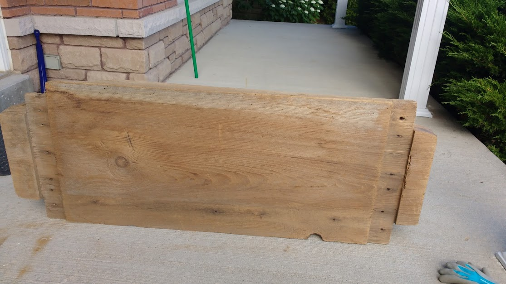
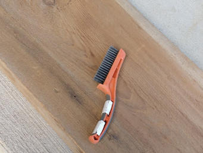
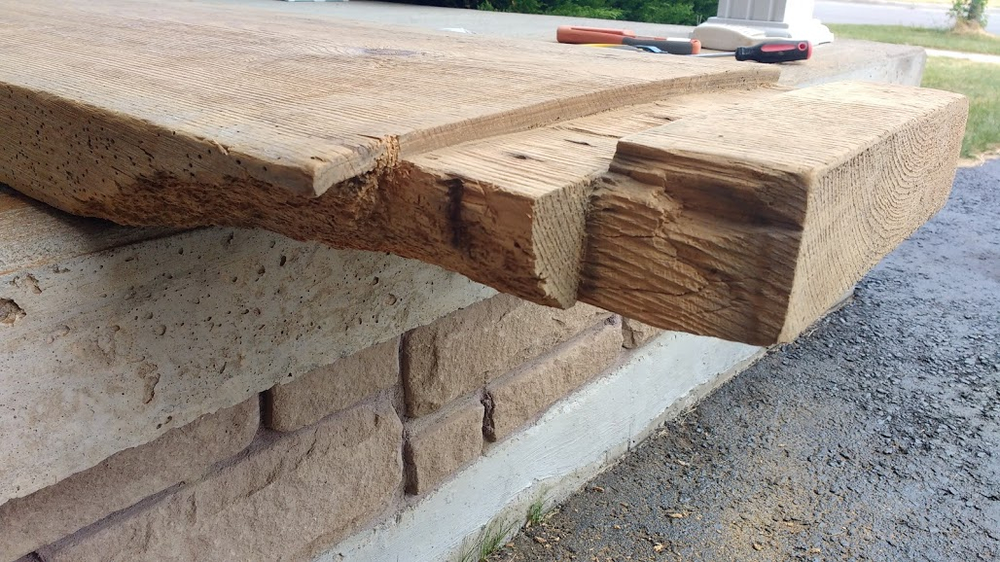
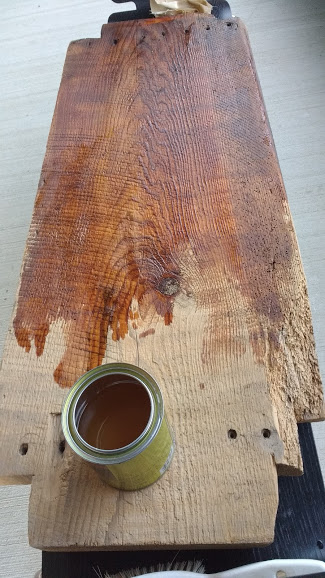
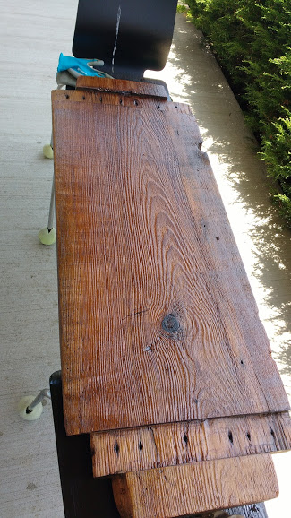
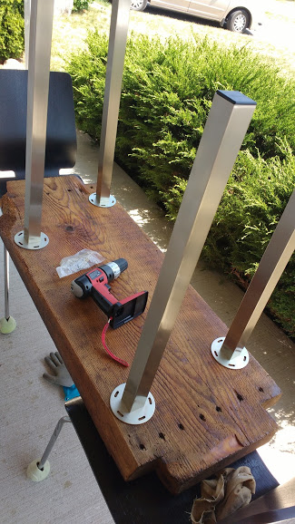
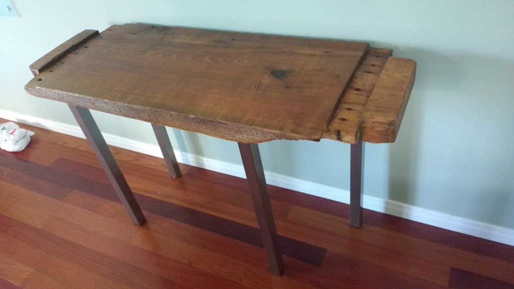
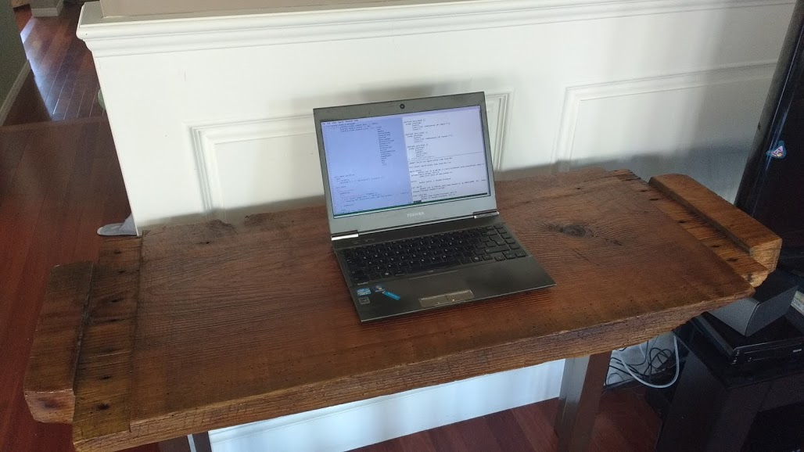

+++
title = "Building a desk"
date = "2016-07-14"
+++

> 
> Someone gave me a really gorgeous piece of wood.
>
> It's exactly what I was hoping to get my hands on.  Given that I have
> absolutely minimal experience working with woods.

---

> I got a steel brush for a few bucks.
> The wood is completely dry, and it was surprisingly easy to remove the dusty
> layer off the surface with some hard brushing.
>
> 

---

> 
>
> The block of wood is full of unique characteristics.  After all, it's these
> things that make it so much fun.
> This particular piece has a rough corner.  I didn't want to do much about it
> except sawing it lightly, and sanding down possible splitters.

---

> I got some wood oil and stains from Canadian Tires.
>
> 

---

> 
> After a few coats of wood stain and gloss finish, it looks absolutely great.

---

> The legs are from IKEA.  Putting the legs are easy enough.  The wood is quite
> soft, and it's really quite easy to drill the guiding holes for the screws.
>
> The only really hard part is that the wood is not perfectly flat, so I had to
> put some inserts and adjusted them repeated to make sure that the legs are
> perfectly leveled.
>
> 

---

> 
>
> *Finally*, it's all done.  Actually, it was so much easier than I thought It
> would have been.  I am so thankful that the wood was already nicely polished
> to start with.

---

> I am happy to report that this blog is written on the desk.
>
> 

Ken Pu   July 15, Oshawa

